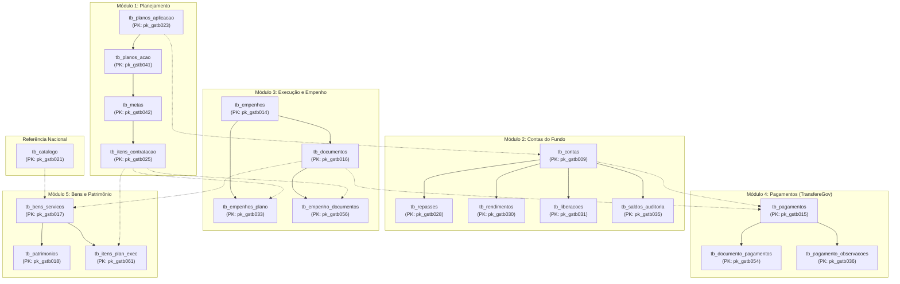

# Manual do Usuário e Dicionário de Dados
## Banco de Dados Gestão Segura (SENASP/MJSP ➔ PostgreSQL)

**Número do Chamado:** 2026090356000138  
**Requisitante/Setor:** Fabiano Silva / SUAG-COFF  
**Responsável Técnico:** Gláucio Silveira e Silva - ASGED  
**Data de Publicação:** Setembro de 2026  
**Versão:** 2.0 (Interface Integrada com 20 Consultas Ativas)  
**Banco de Dados:** `suag` | **Host:** `10.91.61.21:5432` | **Schema:** `"API_MJ"`  

---

## 1. Apresentação e Objetivo do Documento

Este manual foi elaborado com foco exclusivo no **usuário de negócio, gestor público, analista orçamentário e analista de Business Intelligence (BI)** da Secretaria de Estado de Segurança Pública do Distrito Federal (SSP/DF).

Seu objetivo é fornecer uma visão clara, didática e prática sobre como os dados de planejamento, execução de despesas, ordens bancárias, contas do fundo e controle patrimonial do **Fundo Nacional de Segurança Pública (FNSP)** — originários do Sistema Gestão Segura (Ministério da Justiça e Segurança Pública - MJSP) — estão organizados no banco de dados institucional PostgreSQL (`suag`).

Com a expansão da API para **20 recursos em produção**, o pipeline abrange o ciclo orçamentário e financeiro de ponta a ponta:
- **Planejamento:** Planos de Aplicação, Planos de Ação, Metas e Itens de Contratação.
- **Contas do Fundo:** Contas bancárias, repasses recebidos, rendimentos, liberações e saldos.
- **Execução do Empenho:** Processos de compra, empenhos emitidos, documentos de suporte e fracionamentos.
- **Pagamentos Bancários:** Ordens bancárias TransfereGov, rateio por documento e observações de execução.
- **Bens e Patrimônio:** Aquisição de bens/serviços, tombamentos patrimoniais e correlação com o planejamento.
- **Referência:** Catálogo Nacional padronizado de materiais e serviços.

---

## 2. Visão Geral da Arquitetura e Fluxo dos Dados



---

## 3. Matriz Consolidada de Chaves Primárias, Estrangeiras e Volumes

Abaixo está o mapeamento unificado de todas as 20 tabelas que compõem o banco de dados no schema `"API_MJ"`, destacando suas chaves primárias (PK), chaves estrangeiras (FK) e os volumes exatos de registros validados na carga de produção:

| Tabela | Chave Primária (PK) | Chaves Estrangeiras (FKs) | Volume Real (DF) | Descrição do Relacionamento |
|---|---|---|:---:|---|
| `tb_catalogo` | `pk_gstb021` | — | 451 | Catálogo de materiais e serviços padronizados SENASP. |
| `tb_planos_aplicacao` | `pk_gstb023` | — | 21 | Macro-planejamento estratégico por área e ano. |
| `tb_planos_acao` | `pk_gstb041` | `fk_gstb023` | 21 | Termo de adesão/execução formal (versão vigente). |
| `tb_metas` | `pk_gstb042` | `fk_gstb041` | 130 | Metas de entrega acordadas no plano de ação. |
| `tb_itens_contratacao` | `pk_gstb025` | `fk_gstb042`, `fk_gstb021` | 366 | Itens físicos/serviços previstos para contratação. |
| `tb_contas` | `pk_gstb009` | `fk_gstb023`, `fk_gstb008` | 42 | Contas bancárias específicas do fundo no Banco do Brasil. |
| `tb_repasses` | `pk_gstb028` | `fk_gstb009` | 102 | Ordens de repasse federal recebidas na conta. |
| `tb_rendimentos` | `pk_gstb030` | `fk_gstb009` | 1.252 | Rendimentos financeiros gerados pelas aplicações. |
| `tb_liberacoes` | `pk_gstb031` | `fk_gstb009` | 46 | Liberações de recursos pactuadas via SEI/Ofício. |
| `tb_saldos_auditoria` | `pk_gstb035` | `fk_gstb009` | 522 | Registros diários e mensais de saldo em conta. |
| `tb_empenhos` | `pk_gstb014` | — | 998 | Empenho formal (licitação, fornecedor e valor). |
| `tb_empenhos_plano` | `pk_gstb033` | `fk_gstb014`, `fk_gstb023`, `fk_gstb025` | 497 | Vínculo entre empenho emitido e item planejado. |
| `tb_documentos` | `pk_gstb016` | `fk_gstb014` | 2.245 | Notas fiscais e comprovantes de liquidação. |
| `tb_empenho_documentos` | `pk_gstb056` | `fk_gstb014`, `fk_gstb016`, `fk_gstb025` | 1.779 | Fracionamento de despesa empenho ↔ documento. |
| `tb_pagamentos` | `pk_gstb015` | `fk_gstb016`, `fk_gstb009`, `fk_gstb014` | 2.775 | Liquidação financeira bancária TransfereGov (OB). |
| `tb_documento_pagamentos` | `pk_gstb054` | `fk_gstb015`, `fk_gstb016`, `fk_gstb025` | 2.445 | Vínculo detalhado entre pagamento e documento. |
| `tb_pagamento_observacoes`| `pk_gstb036` | `fk_gstb015` | 3 | Observações e justificativas das execuções financeiras. |
| `tb_bens_servicos` | `pk_gstb017` | `fk_gstb021`, `fk_gstb016`, `fk_gstb025`, `fk_gstb015`, `fk_gstb042` | 3.086 | Bem entregue ou serviço atestado na nota fiscal. |
| `tb_patrimonios` | `pk_gstb018` | `fk_gstb017` | 1.803 | Número de tombamento patrimonial do bem (plaquetas). |
| `tb_itens_plan_exec` | `pk_gstb061` | `fk_gstb025`, `fk_gstb017` | 1.431 | Conciliação entre o que foi planejado e o entregue. |
| **TOTAL CONSOLIDADO** | — | — | **20.015** | **Carga 100% íntegra realizada no banco suag.** |

---

## 4. Dicionário de Dados do Usuário (Tabela por Tabela)

### 4.1. Módulo 1: Planejamento

#### `tb_planos_aplicacao` (Macro-Planejamento Geral - 21 registros)
- `pk_gstb023` (PK): Identificador do Plano de Aplicação.
- `sg_uf`: UF beneficiada (`'DF'`).
- `ano_plan`: Ano de referência orçamentária.
- `sg_area_tematica`: Sigla da política de segurança (ex.: RMVI, EVM, MQVPSP).
- `vl_plan_orig_custeio` / `vl_plan_orig_invest`: Valores originais de custeio e investimento.
- `vl_plan_supl_custeio` / `vl_plan_supl_invest`: Valores suplementares aprovados.
- `vl_plan_rend_custeio` / `vl_plan_rend_invest`: Rendimentos alocados.
- `tx_diagnostico`, `tx_justificativa`, `tx_meta_geral`: Textos de fundamentação formal.

#### `tb_planos_acao` (Planos de Ação Vigentes - 21 registros)
- `pk_gstb041` (PK): Identificador do Plano de Ação vigente.
- `fk_gstb023` (FK): Vincula ao Plano de Aplicação.
- `codigo_plano_acao`: Código da proposta no TransfereGov.
- `situacao_plano_acao`: Situação contratual (ex.: `"Aprovado"`).
- `data_inicio_vigencia_plano_acao` / `data_fim_vigencia_plano_acao`: Período de vigência formal.
- `valor_total_repasse_plano_acao`: Montante repassado pela União.
- `valor_recursos_proprios_plano_acao`: Contrapartida do Distrito Federal.
- `valor_total_plano_acao`: Valor global consolidado.
- `no_resp`, `no_gestor`: Dados dos responsáveis técnicos e autoridades titulares.

#### `tb_metas` (Metas Físicas de Entrega - 130 registros)
- `pk_gstb042` (PK): Identificador único da meta.
- `fk_gstb041` (FK): Vincula ao Plano de Ação.
- `numero_meta_plano_acao` / `nome_meta_plano_acao`: Identificação e denominação da meta.
- `valor_meta_plano_acao`: Valor financeiro total previsto para o cumprimento.
- `no_meta_pnsp` / `no_meta_pesp`: Vinculação aos Planos Nacional e Estadual de Segurança.
- `tx_formula_calculo`: Critério de mensuração da meta.

#### `tb_itens_contratacao` (Detalhamento Físico-Financeiro - 366 registros)
- `pk_gstb025` (PK): Identificador do item planejado.
- `fk_gstb042` (FK): Vincula à Meta correspondente.
- `no_instituicao`: Corporação beneficiária (PMDF, PCDF, CBMDF, SSP).
- `tx_bem_servico`: Descrição detalhada do material permanente, consumo ou serviço.
- `qtd_plan`: Quantidade física prevista para contratação.
- `tp_un_medida`: Unidade (unidade, conjunto, kit, licença).
- `vl_plan_orig`: Valor planejado em reais.
- `cl_status_item`: Status da licitação/contratação.
- `nr_cod_senasp`: Código padronizado de catálogo SENASP.

---

### 4.2. Módulo 2: Contas do Fundo e Gestão Bancária

#### `tb_contas` (Contas Bancárias Vinculadas - 42 registros)
- `pk_gstb009` (PK): Identificador único da conta bancária.
- `fk_gstb023` (FK): Vincula ao Plano de Aplicação.
- `n_ag` / `n_conta`: Número da agência e conta corrente bancária.
- `nome_banco_plano_acao_dado_bancario`: Instituição bancária mantenedora (ex.: Banco do Brasil).
- `vl_saldo_auditoria`: Saldo financeiro apurado.
- `recurso` / `eixo`: Exercício e eixo de destinação do recurso.

#### `tb_repasses` (Repasses Federais Recebidos - 102 registros)
- `pk_gstb028` (PK): Identificador único do repasse.
- `fk_gstb009` (FK): Conta bancária de crédito.
- `tp_repasse`: Tipo do instrumento (Termo de Adesão, Convênio).
- `vl_repasse`: Valor financeiro repassado (R$).
- `dt_repasse`: Data do crédito bancário.

#### `tb_rendimentos` (Rendimentos Financeiros - 1.252 registros)
- `pk_gstb030` (PK): Identificador do registro de rendimento.
- `fk_gstb009` (FK): Conta bancária aplicadora.
- `vl_rend`: Valor do rendimento líquido creditado (R$).
- `dt_rend`: Data de apuração do rendimento.

#### `tb_liberacoes` (Liberações Oficiais de Recurso - 46 registros)
- `pk_gstb031` (PK): Identificador da liberação.
- `fk_gstb009` (FK): Conta bancária autorizada.
- `nr_oficio` / `nr_sei`: Número do ofício e processo administrativo SEI autorizador.
- `vl_lib`: Valor autorizado para desembolso (R$).
- `dt_lib`: Data da autorização formal.

#### `tb_saldos_auditoria` (Evolução Histórica de Saldos - 522 registros)
- `pk_gstb035` (PK): Identificador do apontamento de saldo.
- `fk_gstb009` (FK): Conta bancária auditada.
- `dt_saldo`: Data de fechamento do saldo.
- `vl_saldo`: Saldo verificado na data de corte (R$).

---

### 4.3. Módulo 3: Execução do Empenho e Documentos de Suporte

#### `tb_empenhos` (Empenhos Emitidos - 998 registros)
- `pk_gstb014` (PK): Identificador do empenho.
- `nr_empenho`: Número do empenho emitido (ex.: SIAFE / SIANET).
- `nr_proc_compra`: Número do processo licitatório/compra.
- `nr_licitacao` / `tp_licitacao`: Modalidade e número da licitação (Pregão, Inexigibilidade, Dispensa).
- `no_fornecedor` / `nr_cnpj_fornecedor`: Razão social e CNPJ da empresa contratada.
- `vl_empenho`: Valor total empenhado (R$).
- `dt_empenho`: Data de emissão da nota de empenho.

#### `tb_empenhos_plano` (Vínculo Empenho ↔ Item Planejado - 497 registros)
- `pk_gstb033` (PK): Identificador do vínculo.
- `fk_gstb014` (FK): Empenho emitido.
- `fk_gstb025` (FK): Item planejado na contratação (`tb_itens_contratacao`).
- `vl_planejado`: Parcela do valor do empenho alocada a este item específico.

#### `tb_documentos` (Notas Fiscais e Comprovantes - 2.245 registros)
- `pk_gstb016` (PK): Identificador do documento fiscal/suporte.
- `fk_gstb014` (FK): Empenho vinculado.
- `tp_doc_suporte`: Tipo de comprovante (Nota Fiscal Eletrônica, Recibo, Fatura).
- `nr_doc_suporte`: Número da Nota Fiscal.
- `nr_chave_doc_suporte`: Chave de acesso de 44 dígitos da NF-e.
- `dt_doc_suporte`: Data de emissão da nota.
- `vl_total_doc`: Valor total faturado (R$).
- `fl_totalmente_pago`: Indicador de quitação integral (`'S'` ou `'N'`).

#### `tb_empenho_documentos` (Fracionamento Empenho ↔ Documento - 1.779 registros)
- `pk_gstb056` (PK): Identificador do fracionamento.
- `fk_gstb014` (FK): Empenho relacionado.
- `fk_gstb016` (FK): Documento fiscal relacionado.
- `fk_gstb025` (FK): Item planejado.
- `vl_fracionado`: Parcela monetária liquidada nesta fração.

---

### 4.4. Módulo 4: Pagamentos Bancários (Origem TransfereGov)

#### `tb_pagamentos` (Execuções Bancárias / Ordens de Pagamento - 2.775 registros)
- `pk_gstb015` (PK): Identificador único da transação de pagamento.
- `fk_gstb016` (FK): Documento fiscal quitado.
- `fk_gstb009` (FK): Conta bancária de origem do débito.
- `fk_gstb014` (FK): Empenho original.
- `id_transferegov`: Identificador único do lote no TransfereGov.
- `dt_pag_banc`: Data efetiva de liquidação bancária.
- `vl_pag_banc`: Valor financeiro desembolsado (R$).
- `nome_beneficiario_subtransacao_gestao_financeira`: Razão social do favorecido.
- `numero_documento_beneficiario_subtransacao_gestao_financeira_ma`: CNPJ/CPF do favorecido mascarado para conformidade com LGPD.
- `descricao_gestao_financeira`: Descrição da ordem bancária (ex.: Emissão de Ordem Bancária, DOC/TED).

#### `tb_documento_pagamentos` (Vínculo Documento ↔ Pagamento - 2.445 registros)
- `pk_gstb054` (PK): Identificador do vínculo.
- `fk_gstb015` (FK): Pagamento bancário.
- `fk_gstb016` (FK): Documento de suporte.
- `vl_pag_fracionado`: Parcela do pagamento creditada contra este documento.

#### `tb_pagamento_observacoes` (Histórico de Observações - 3 registros)
- `pk_gstb036` (PK): Identificador da nota explicativa.
- `fk_gstb015` (FK): Pagamento relacionado.
- `dt_obs`: Data de registro da observação.
- `user_obs`: Identificador do operador responsável pelo registro.
- `tx_obs`: Texto explicativo sobre a liquidação bancária.

---

### 4.5. Módulo 5: Bens e Patrimônio

#### `tb_bens_servicos` (Bens e Serviços Entregues - 3.086 registros)
- `pk_gstb017` (PK): Identificador do bem/serviço entregue.
- `fk_gstb016` (FK): Documento de suporte fiscal da aquisição.
- `fk_gstb021` (FK): Código de catalogação nacional (`tb_catalogo`).
- `fk_gstb025` (FK): Item de planejamento de origem.
- `no_bem_servico`: Descrição comercial do material ou equipamento recebido.
- `qtd_item`: Quantidade de unidades atestadas no termo de recebimento.
- `vl_unitario`: Preço unitário pactuado na entrega (R$).
- `no_orgao`: Órgão da segurança beneficiado (Polícia Civil, Polícia Militar, Bombeiros, SSP).

#### `tb_patrimonios` (Tombamento Patrimonial - 1.803 registros)
- `pk_gstb018` (PK): Identificador do tombamento.
- `fk_gstb017` (FK): Bem/equipamento adquirido.
- `nr_patrimonio`: **Número da plaqueta de patrimônio / tombamento** atribuído ao equipamento.

#### `tb_itens_plan_exec` (Vínculo Planejado ↔ Executado - 1.431 registros)
- `pk_gstb061` (PK): Identificador da conciliação.
- `fk_gstb025` (FK): Item originalmente planejado.
- `fk_gstb017` (FK): Bem efetivamente entregue.
- `vl_fracionado`: Valor monetário conciliado nesta ligação.
- `tp_vinculo`: Tipo de conciliação (ex.: `"MANUAL"`, `"AUTOMÁTICO"`).
- `tx_obs`: Justificativa técnica do vínculo estabelecido.

---

### 4.6. Módulo 6: Tabela de Referência Nacional

#### `tb_catalogo` (Catálogo Nacional de Materiais e Serviços Padronizados - 451 registros)
- `pk_gstb021` (PK): Identificador do item de catálogo nacional da SENASP.
- `no_grupo` / `no_classe`: Família e classe de padronização de segurança pública.
- `no_bem_serv`: Descrição oficial padronizada do material ou serviço.
- `no_nd`: Natureza da Despesa padrão (Investimento ou Custeio).
- `nr_cod_senasp_dsusp`: Código nacional SENASP (ex.: `MAT.04.006.0001`).

---

## 5. Consultas Analíticas Prontas em SQL

### Exemplo 1: Rastreabilidade Total (Do Planejamento ao Tombamento Patrimonial)
```sql
SELECT 
    pa.ano_plan AS exercicio,
    pa.sg_area_tematica,
    ic.tx_bem_servico AS item_planejado,
    ic.no_instituicao AS corporacao,
    emp.nr_empenho,
    emp.no_fornecedor,
    doc.nr_doc_suporte AS nota_fiscal,
    doc.dt_doc_suporte AS data_nf,
    bs.no_bem_servico AS equipamento_entregue,
    pat.nr_patrimonio AS plaqueta_tombamento
FROM "API_MJ".tb_planos_aplicacao pa
INNER JOIN "API_MJ".tb_planos_acao pac ON pac.fk_gstb023 = pa.pk_gstb023
INNER JOIN "API_MJ".tb_metas m ON m.fk_gstb041 = pac.pk_gstb041
INNER JOIN "API_MJ".tb_itens_contratacao ic ON ic.fk_gstb042 = m.pk_gstb042
LEFT JOIN "API_MJ".tb_empenhos_plano ep ON ep.fk_gstb025 = ic.pk_gstb025
LEFT JOIN "API_MJ".tb_empenhos emp ON emp.pk_gstb014 = ep.fk_gstb014
LEFT JOIN "API_MJ".tb_documentos doc ON doc.fk_gstb014 = emp.pk_gstb014
LEFT JOIN "API_MJ".tb_bens_servicos bs ON bs.fk_gstb016 = doc.pk_gstb016
LEFT JOIN "API_MJ".tb_patrimonios pat ON pat.fk_gstb017 = bs.pk_gstb017
WHERE pa.sg_uf = 'DF'
ORDER BY pa.ano_plan DESC, emp.nr_empenho;
```

### Exemplo 2: Posição Financeira por Conta do Fundo (Repasses vs. Pagamentos)
```sql
SELECT 
    c.n_ag AS agencia,
    c.n_conta AS conta_corrente,
    c.recurso AS exercicio,
    c.eixo AS politica_publica,
    COALESCE(SUM(rep.vl_repasse), 0) AS total_repasses_recebidos,
    COALESCE(SUM(pag.vl_pag_banc), 0) AS total_pagamentos_executados,
    COALESCE(c.vl_saldo_auditoria, 0) AS saldo_disponivel_banco
FROM "API_MJ".tb_contas c
LEFT JOIN "API_MJ".tb_repasses rep ON rep.fk_gstb009 = c.pk_gstb009
LEFT JOIN "API_MJ".tb_pagamentos pag ON pag.fk_gstb009 = c.pk_gstb009
WHERE c.sg_uf = 'DF'
GROUP BY c.n_ag, c.n_conta, c.recurso, c.eixo, c.vl_saldo_auditoria
ORDER BY c.recurso DESC;
```

---

## 6. Orientações para Modelagem no Power BI

1. **Construção do Star-Schema:**
   - **Tabelas de Fato:** `tb_itens_contratacao`, `tb_pagamentos`, `tb_bens_servicos`, `tb_patrimonios`.
   - **Tabelas de Dimensão:** `tb_planos_aplicacao`, `tb_planos_acao`, `tb_metas`, `tb_contas`, `tb_catalogo`, `tb_empenhos`.
2. **Cardinalidade e Filtros Cruzados:**
   - Configure relacionamentos de **1 para Muitos (1 : N)** com direção de filtro cruzado **Único**, fluindo das dimensões para as tabelas de fato.
3. **Auditoria de Carga:**
   - Monitore o campo `MAX(dt_carga)` em cada tabela para exibir cartões com a data e hora exata da última atualização automática.
