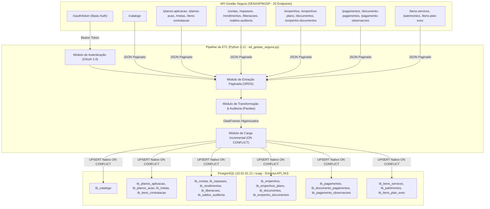

# Relatório Técnico de Implantação e Governança do Pipeline de ETL

**Número do Chamado:** 2026090356000138  
**Requisitante/Setor:** Fabiano Silva / SUAG-COFF  

## Integração API Gestão Segura (SENASP/MJSP) ➔ PostgreSQL

**Data da Implantação:** 10 de Setembro de 2026 (v1.0) | **Atualização:** 14 de Setembro de 2026 (v2.0)  
**Ambiente:** Servidor PostgreSQL (`10.91.61.21:5432`)  
**Banco de Dados de Destino:** `suag`  
**Schema de Destino:** `API_MJ`  
**Responsável Técnico:** Gláucio Silveira e Silva - ASGED  

---

## 1. Sumário Executivo

Este documento formaliza a arquitetura, regras de negócio, governança e dicionário completo de dados implementados para a automação do processo de Extração, Transformação e Carga (**ETL**) dos dados do Sistema **Gestão Segura** (Fundo Nacional de Segurança Pública / SENASP-MJSP) para o banco de dados institucional **`suag`** hospedado no servidor PostgreSQL **`10.91.61.21:5432`** no schema **`API_MJ`**.

Na versão **2.0**, a solução foi ampliada de 4 para **20 recursos REST integrados**, cobrindo o ciclo completo de **Planejamento**, **Contas Bancárias do Fundo**, **Execução de Empenhos**, **Pagamentos TransfereGov**, **Bens e Tombamento Patrimonial** e o **Catálogo Nacional de Materiais e Serviços**.

O pipeline opera de forma autônoma, resiliente e idempotente, implementando **cargas incrementais com estratégia de UPSERT (ON CONFLICT nativo)**, auditoria de dados (`dt_carga`), evolução automática de colunas e geração de logs estruturados.

---

## 2. Arquitetura da Solução e Encadeamento Relacional Expandido

A cadeia de dados do Ministério da Justiça abrange 6 módulos operacionais:




---

## 3. Especificação dos Componentes Técnicos

### 3.1. Autenticação e Segurança
- **Protocolo:** OAuth 2.0 (Fluxo *Client Credentials*).
- **Mecanismo:** HTTP Basic Auth com `client_id` e `client_secret`.
- **Cabeçalho Crítico:** Envio estrito de `Accept: application/json` no endpoint `/oauth/token`. Esse cabeçalho é obrigatório para evitar que o servidor Oracle APEX retorne página HTML de erro.
- **Isolamento por UF:** A credencial institucional da SSP/DF vinculada no Ministério da Justiça aplica filtro automático no backend. Apenas registros pertinentes ao Distrito Federal são trafegados.
- **Gestão de Segredos:** Credenciais desacopladas em arquivo `.env` protegido com suporte a variáveis de ambiente do sistema operacional.

### 3.2. Extração e Paginação
- **Envelope ORDS:** Tratamento dinâmico dos metadados de coleção do Oracle REST Data Services: `items`, `hasMore`, `limit` (padrão 25) e `offset`.
- **Algoritmo:** Inicia em `offset=0` e avança somando o `limit` a cada iteração, encerrando assim que `hasMore` for `false`.

### 3.3. Transformação e Higienização de Dados
- **Limpeza de Hiperlinks HATEOAS:** Remoção automática da coluna `links` (links REST) para evitar inconsistências no banco relacional.
- **Serialização de Estruturas Aninhadas:** Conversão preventiva de estruturas aninhadas em texto/JSON legível.
- **Metadados de Auditoria:** Inclusão automática do campo **`dt_carga`** (timestamp de processamento) em todas as tabelas.
- **Evolução de Esquema (Schema Evolution):** O script compara a estrutura da extração com a tabela de destino e adiciona colunas novas automaticamente via `ALTER TABLE` caso o Ministério da Justiça disponibilize novos atributos futuramente.

### 3.4. Carga Incremental com PostgreSQL ON CONFLICT (UPSERT)
O pipeline adota a técnica de **UPSERT**:
1. Os dados da extração atual são carregados na tabela transitória `"API_MJ"."stg_{tabela}"`.
2. Uma instrução nativa **`INSERT ... ON CONFLICT (primary_key) DO UPDATE SET`** é disparada no PostgreSQL:
   - **`ON CONFLICT (PK) DO UPDATE`**: Atualiza as colunas de dados e renova a data de auditoria (`dt_carga`).
   - Se o registro não existir: Insere o novo registro completo no banco.
3. A tabela de staging é eliminada ao término do processamento de cada recurso.
4. O script [ddl_postgresql_api_mj.sql](ddl_postgresql_api_mj.sql) contém a modelagem DDL completa com PKs e índices de performance.

---

### 3.5. Especificação dos Payloads de Resposta da API e Mapeamento para o PostgreSQL

Esta seção detalha a estrutura de resposta (payload JSON) retornada por cada endpoint da API do Sistema Gestão Segura (SENASP/MJSP), detalhando a tipagem recebida, o tratamento realizado pelo pipeline de dados e o mapeamento relacional para as tabelas no PostgreSQL. Essa documentação serve como referência técnica prioritária para diagnóstico de anomalias, dados faltantes ou alterações de contrato por parte do Ministério da Justiça.

---

#### 3.5.1. Estrutura Padrão do Envelope de Resposta (Oracle APEX / ORDS)

Todas as requisições GET retornam uma coleção de dados envolvida na estrutura padrão do Oracle REST Data Services (ORDS):

```json
{
  "items": [
    { /* Objeto do recurso (plano, meta ou item) */ }
  ],
  "hasMore": false,
  "limit": 25,
  "offset": 0,
  "count": 21,
  "links": [
    { "rel": "self", "href": "https://apps.mj.gov.br/ws_20250508093400/api/v1/planos-aplicacao" },
    { "rel": "describedby", "href": "https://apps.mj.gov.br/.../metadata-catalog/..." }
  ]
}
```

- **`items`**: Matriz (array) com os registros de dados de negócio.
- **`hasMore`**: Booleano (`true`/`false`). Se `true`, indica que existem registros adicionais a serem consumidos no próximo `offset`.
- **`limit`**: Quantidade máxima de registros retornados por página (padrão da API: 25).
- **`offset`**: Índice de deslocamento inicial da página atual.
- **`count`**: Número exato de itens contidos na página atual.
- **`links`**: Hiperlinks HATEOAS da arquitetura REST. São descartados no pipeline para manter a integridade relacional.

---

#### 3.5.2. Payload do Endpoint de Autenticação: `/oauth/token`

- **Método HTTP:** `POST`
- **Headers Mandatórios:**
  - `Accept: application/json` *(obrigatório: sem este cabeçalho o servidor APEX retorna HTML de erro)*
  - `Content-Type: application/x-www-form-urlencoded`
- **Corpo da Requisição:** `grant_type=client_credentials`
- **Payload de Resposta (JSON):**
```json
{
  "access_token": "gZ7...kQW",
  "token_type": "bearer",
  "expires_in": 3600
}
```
- **Campos e Mapeamento:**
  - `access_token` (string): Token de autorização Bearer utilizado no header `Authorization: Bearer <token>` das chamadas subsequentes.
  - `token_type` (string): Tipo do token (`bearer`).
  - `expires_in` (integer): Tempo de vigência em segundos (3600s = 1 hora).

---

#### 3.5.3. Endpoint 1: `/api/v1/planos-aplicacao` ➔ `"API_MJ".tb_planos_aplicacao`

- **Finalidade:** Raiz do planejamento orçamentário anual por área temática.
- **Volume Típico (SSP/DF):** 21 registros (1 página).

##### Exemplo de Payload Real de Resposta (item único do array `items`):
```json
{
  "pk_gstb023": 441,
  "sg_uf": "DF",
  "ano_plan": "2025",
  "sg_area_tematica": "RMVI",
  "vl_plan_orig_custeio": "3500000.00",
  "vl_plan_orig_invest": "12450000.00",
  "vl_plan_supl_custeio": null,
  "vl_plan_supl_invest": null,
  "vl_plan_rend_custeio": "0.00",
  "vl_plan_rend_invest": "0.00",
  "tx_diagnostico": "Diagnóstico situacional da segurança pública...",
  "tx_justificativa": "Justificativa técnica para aplicação dos recursos...",
  "tx_meta_geral": "Meta geral pactuada para a área temática...",
  "links": [{ "rel": "self", "href": "..." }]
}
```

##### Anatomia do Payload e Mapeamento de Tipos:
| Campo no Payload JSON | Tipo no JSON | Tipo no PostgreSQL | Regra de Negócio / Tratamento no ETL |
| :--- | :--- | :--- | :--- |
| `pk_gstb023` | `Integer` | `BIGINT` (PK) | Identificador primário único do plano de aplicação geral. |
| `sg_uf` | `String` | `TEXT` | Sigla da UF vinculada à credencial institucional (`"DF"`). |
| `ano_plan` | `String` | `TEXT` | Ano de referência do exercício financeiro (ex.: `"2025"`). |
| `sg_area_tematica` | `String` | `TEXT` | Sigla temática do plano (ex.: `"RMVI"`, `"EVM"`, `"MQVPSP"`). |
| `vl_plan_orig_custeio` | `String / Number` | `TEXT` | Montante orçamentário original de custeio. |
| `vl_plan_orig_invest` | `String / Number` | `TEXT` | Montante orçamentário original de investimento. |
| `vl_plan_supl_*` | `Null / String` | `TEXT` | Valores suplementares autorizados (comumente nulos no início do exercício). |
| `vl_plan_rend_*` | `String / Number` | `TEXT` | Rendimentos auferidos de aplicações financeiras. |
| `tx_diagnostico` | `String` | `TEXT` | Texto descritivo do diagnóstico situacional da UF. |
| `tx_justificativa` | `String` | `TEXT` | Texto justificativo de aplicação dos recursos do FNSP. |
| `tx_meta_geral` | `String` | `TEXT` | Macro-objetivo pactuado com o MJSP. |
| *(Auditoria)* | *(Gerado pelo ETL)* | `TIMESTAMP` | Campo **`dt_carga`** com timestamp da gravação no PostgreSQL. |

---

#### 3.5.4. Endpoint 2: `/api/v1/planos-acao` ➔ `"API_MJ".tb_planos_acao`

- **Finalidade:** Planos de ação em execução/vigentes (dados originários da integração com TransfereGov).
- **Regra Crítica da API:** Envia **apenas a versão vigente**. Planos históricos ou aditivos anteriores não são listados.
- **Volume Típico (SSP/DF):** 21 registros (1 página).

##### Exemplo de Payload Real de Resposta (item único do array `items`):
```json
{
  "pk_gstb041": 764,
  "fk_gstb023": 441,
  "sg_uf": "DF",
  "ano_plan": "2025",
  "codigo_plano_acao": "PA-2025-DF-001",
  "situacao_plano_acao": "Aprovado",
  "data_inicio_vigencia_plano_acao": "2025-01-01T00:00:00Z",
  "data_fim_vigencia_plano_acao": "2027-12-31T23:59:59Z",
  "valor_repasse_emenda_plano_acao": "0.00",
  "valor_total_repasse_plano_acao": "15950000.00",
  "valor_total_plano_acao": "15950000.00",
  "valor_total_investimento_plano_acao": "12450000.00",
  "valor_total_custeio_plano_acao": "3500000.00",
  "valor_saldo_disponivel_plano_acao": "15950000.00",
  "nome_orgao_repassador_plano_acao": "MINISTERIO DA JUSTICA E SEGURANCA PUBLICA",
  "nome_ente_recebedor_plano_acao": "GOVERNO DO DISTRITO FEDERAL",
  "nome_fundo_recebedor_plano_acao": "FUNDO DE SEGURANCA PUBLICA DO DF",
  "tx_estrategia": "Estratégia institucional...",
  "no_resp": "Ivan Martins de Siqueira",
  "no_gestor": "Sandro Torres Avelar",
  "hash_validacao": "DB8D8AE8750E7FFF001C76A0F3D9B37B",
  "links": [{ "rel": "self", "href": "..." }]
}
```

##### Anatomia do Payload e Mapeamento de Tipos:
| Campo no Payload JSON | Tipo no JSON | Tipo no PostgreSQL | Regra de Negócio / Tratamento no ETL |
| :--- | :--- | :--- | :--- |
| `pk_gstb041` | `Integer` | `BIGINT` (PK) | Identificador único da versão vigente do plano de ação. |
| `fk_gstb023` | `Integer` | `BIGINT` (FK) | Chave estrangeira de ligação com `tb_planos_aplicacao(pk_gstb023)`. |
| `codigo_plano_acao` | `String` | `TEXT` | Identificador de protocolo no TransfereGov. |
| `data_inicio_vigencia_*` | `String (ISO-8601)` | `TIMESTAMP` | Normalizado via `pd.to_datetime()` para tipo temporal nativo. |
| `data_fim_vigencia_*` | `String (ISO-8601)` | `TIMESTAMP` | Normalizado via `pd.to_datetime()` para tipo temporal nativo. |
| `valor_total_plano_acao` | `String / Number` | `TEXT` | Valor consolidado global pactuado no plano. |
| `id_ente_*` / `cnpj_*` | `String` | `TEXT` | Dados cadastrais do ente repassador (União) e recebedor (GDF). |
| `id_fundo_*` / `cnpj_*` | `String` | `TEXT` | Dados do Fundo Nacional (FNSP) e do Fundo Distrital (FSP/DF). |
| `no_resp` / `no_gestor` | `String` | `TEXT` | Nome do titular técnico e do gestor do plano de ação. |
| `hash_validacao` | `String` | `TEXT` | Assinatura de integridade criptográfica da proposta. |

---

#### 3.5.5. Endpoint 3: `/api/v1/metas` ➔ `"API_MJ".tb_metas`

- **Finalidade:** Metas físicas e de entrega atreladas aos planos de ação vigentes.
- **Volume Típico (SSP/DF):** 130 registros (~6 páginas ORDS).

##### Exemplo de Payload Real de Resposta (item único do array `items`):
```json
{
  "pk_gstb042": 1892,
  "fk_gstb041": 764,
  "pk_gstb041": 764,
  "sg_uf": "DF",
  "ano_plan": "2025",
  "numero_meta_plano_acao": "2",
  "nome_meta_plano_acao": "Alcançar o índice de 82% na taxa de elucidação de crimes de feminicídio até dez/2027",
  "valor_meta_plano_acao": null,
  "cl_periodicidade": "Anual",
  "no_carteira_pol_mjsp": "Política de Enfrentamento da Criminalidade Violenta",
  "no_meta_pesp": "Reduzir o índice de feminicídio p/ 1,08/100 hab.",
  "no_meta_pnsp": "Meta 4: Reduzir a taxa nacional de mortes violentas de mulheres...",
  "cl_status_meta": "Aprovada",
  "tx_formula_calculo": "(Procedimentos elucidados / Total procedimentos) x 100",
  "descricao_meta_plano_acao": "Taxa de elucidação de crimes de feminicídio",
  "cl_antigo": "S",
  "links": [{ "rel": "self", "href": "..." }]
}
```

##### Anatomia do Payload e Mapeamento de Tipos:
| Campo no Payload JSON | Tipo no JSON | Tipo no PostgreSQL | Regra de Negócio / Tratamento no ETL |
| :--- | :--- | :--- | :--- |
| `pk_gstb042` | `Integer` | `BIGINT` (PK) | Identificador primário da meta no Gestão Segura. |
| `fk_gstb041` | `Integer` | `BIGINT` (FK) | Chave estrangeira que vincula a meta ao plano de ação vigente. |
| `pk_gstb041` | `Integer` | `BIGINT` | Chave redundante de navegação mantida pela API. |
| `numero_meta_plano_acao`| `String` | `TEXT` | Numeração de ordenamento da meta dentro do plano. |
| `nome_meta_plano_acao` | `String` | `TEXT` | Título sintético da meta pactuada. |
| `no_meta_pesp` | `String` | `TEXT` | Alinhamento com o Plano Estadual de Segurança Pública do DF. |
| `no_meta_pnsp` | `String` | `TEXT` | Alinhamento com as diretrizes do Plano Nacional de Segurança Pública. |
| `tx_formula_calculo` | `String` | `TEXT` | Metodologia matemática ou descritiva de apuração da meta. |
| `cl_status_meta` | `String` | `TEXT` | Situação de homologação da meta (ex.: `"Aprovada"`). |

---

#### 3.5.6. Endpoint 4: `/api/v1/itens-contratacao` ➔ `"API_MJ".tb_itens_contratacao`

- **Finalidade:** Detalhamento físico-financeiro das contratações planejadas (bens, serviços e quantitativos).
- **Volume Típico (SSP/DF):** 366 registros (~15 páginas ORDS).

##### Exemplo de Payload Real de Resposta (item único do array `items`):
```json
{
  "pk_gstb025": 11090,
  "fk_gstb042": 1892,
  "pk_gstb042": 1892,
  "pk_gstb041": 764,
  "sg_uf": "DF",
  "ano_plan": "2025",
  "no_acao": "I b) - a criação, a ampliação e o aperfeiçoamento da investigação criminal...",
  "fk_gstb021": 308,
  "tx_bem_servico": "Contratação de empresa para prestação de serviço técnico especializado...",
  "no_destinacao": "Núcleos Integrados de Atendimento à Mulher nas Delegacias",
  "nr_cod_senasp": "MAT.10.041.0001",
  "no_instituicao": "POLÍCIA CIVIL",
  "qtd_plan": 5,
  "tp_un_medida": "Unidade",
  "vl_plan_orig": 474471.23,
  "vl_plan_supl": null,
  "vl_plan_rend": null,
  "cl_status_item": "Aprovado",
  "nr_art": "Aderência ao Art. 7º da portaria nº 685:",
  "cl_antigo": "S",
  "links": [{ "rel": "self", "href": "..." }]
}
```

##### Anatomia do Payload e Mapeamento de Tipos:
| Campo no Payload JSON | Tipo no JSON | Tipo no PostgreSQL | Regra de Negócio / Tratamento no ETL |
| :--- | :--- | :--- | :--- |
| `pk_gstb025` | `Integer` | `BIGINT` (PK) | Identificador único do item de contratação planejada. |
| `fk_gstb042` | `Integer` | `BIGINT` (FK) | Chave estrangeira de vinculação direta com `tb_metas(pk_gstb042)`. |
| `pk_gstb041` | `Integer` | `BIGINT` | Chave de navegação direta até o plano de ação vigente. |
| `tx_bem_servico` | `String` | `TEXT` | Especificação detalhada do material permanente, consumo ou serviço. |
| `no_instituicao` | `String` | `TEXT` | Corporação beneficiária (ex.: `"POLÍCIA CIVIL"`, `"PMDF"`, `"CBMDF"`). |
| `qtd_plan` | `Integer` | `BIGINT` | Quantidade física planejada para aquisição. |
| `tp_un_medida` | `String` | `TEXT` | Unidade de fornecimento (ex.: `"Unidade"`, `"Kit"`, `"Licença"`). |
| `vl_plan_orig` | `Number (Float)` | `DOUBLE PRECISION` | Valor financeiro estimado para a aquisição (R$). |
| `nr_cod_senasp` | `String` | `TEXT` | Código de padronização do catálogo de materiais da SENASP/MJSP. |
| `cl_status_item` | `String` | `TEXT` | Situação de execução da compra (ex.: `"Aprovado"`, `"Em Licitação"`). |

---

#### 3.5.7. Matriz de Correlação e Troubleshooting Completo (20 Endpoints ➔ 20 Tabelas PostgreSQL)

Abaixo está a matriz técnica consolidada de todos os 20 endpoints integrados na versão 2.0 do pipeline, com suas respectivas chaves primárias e estrangeiras, volumes reais validados na carga de produção e orientações preventivas de diagnóstico:

| # | Endpoint da API | Tabela PostgreSQL | Chave Primária (PK) | Chaves Estrangeiras (FKs) | Registros Reais (DF) | Páginas ORDS | Comportamento / Ação Corretiva |
|---|---|---|:---:|:---:|:---:|:---:|---|
| - | `/oauth/token` | *(Autenticação)* | — | — | — | 1 chamada | Enviar cabeçalho `Accept: application/json` obrigatório. |
| 1 | `/catalogo` | `tb_catalogo` | `pk_gstb021` | — | 451 | ~19 | Catálogo nacional da SENASP (não possui filtro de UF). |
| 2 | `/planos-aplicacao` | `tb_planos_aplicacao` | `pk_gstb023` | — | 21 | 1 | Macro-planejamento anual por área temática. |
| 3 | `/planos-acao` | `tb_planos_acao` | `pk_gstb041` | `fk_gstb023` | 21 | 1 | Apenas versões vigentes no TransfereGov são retornadas. |
| 4 | `/metas` | `tb_metas` | `pk_gstb042` | `fk_gstb041` | 130 | ~6 | Metas físicas pactuadas vinculadas aos planos de ação. |
| 5 | `/itens-contratacao` | `tb_itens_contratacao` | `pk_gstb025` | `fk_gstb042`, `fk_gstb021` | 366 | ~15 | Detalhamento físico-financeiro das aquisições. |
| 6 | `/contas` | `tb_contas` | `pk_gstb009` | `fk_gstb023`, `fk_gstb008` | 42 | ~2 | Contas correntes bancárias no Banco do Brasil. |
| 7 | `/repasses` | `tb_repasses` | `pk_gstb028` | `fk_gstb009` | 102 | ~5 | Repasses federais de recursos creditados em conta. |
| 8 | `/rendimentos` | `tb_rendimentos` | `pk_gstb030` | `fk_gstb009` | 1.252 | ~51 | Rendimentos auferidos de aplicações financeiras. |
| 9 | `/liberacoes` | `tb_liberacoes` | `pk_gstb031` | `fk_gstb009` | 46 | ~2 | Liberações formais pactuadas via Processo SEI/Ofício. |
| 10 | `/saldos-auditoria` | `tb_saldos_auditoria` | `pk_gstb035` | `fk_gstb009` | 522 | ~21 | Histórico diário e mensal de fechamento de saldos. |
| 11 | `/empenhos` | `tb_empenhos` | `pk_gstb014` | — | 998 | ~40 | Empenhos emitidos (processo de compra, fornecedor e valor). |
| 12 | `/empenhos-plano` | `tb_empenhos_plano` | `pk_gstb033` | `fk_gstb014`, `fk_gstb025` | 497 | ~20 | Vínculo entre empenho executado e item planejado. |
| 13 | `/documentos` | `tb_documentos` | `pk_gstb016` | `fk_gstb014` | 2.245 | ~90 | Notas fiscais eletrônicas e comprovantes de liquidação. |
| 14 | `/empenho-documentos`| `tb_empenho_documentos`| `pk_gstb056` | `fk_gstb014`, `fk_gstb016` | 1.779 | ~72 | Fracionamento de liquidação contábil por nota e empenho. |
| 15 | `/pagamentos` | `tb_pagamentos` | `pk_gstb015` | `fk_gstb016`, `fk_gstb009` | 2.775 | ~111 | Ordens bancárias de pagamento no TransfereGov (OB). |
| 16 | `/documento-pagamentos`| `tb_documento_pagamentos`| `pk_gstb054` | `fk_gstb015`, `fk_gstb016` | 2.445 | ~98 | Rateio e liquidação financeira do pagamento por documento. |
| 17 | `/pagamento-observacoes`| `tb_pagamento_observacoes`| `pk_gstb036`| `fk_gstb015` | 3 | 1 | Notas explicativas e justificativas dos pagamentos. |
| 18 | `/bens-servicos` | `tb_bens_servicos` | `pk_gstb017` | `fk_gstb016`, `fk_gstb021` | 3.086 | ~124 | Bens materiais ou serviços entregues e atestados. |
| 19 | `/patrimonios` | `tb_patrimonios` | `pk_gstb018` | `fk_gstb017` | 1.803 | ~73 | Tombamento físico e numeração de plaquetas de patrimônio. |
| 20 | `/itens-plan-exec` | `tb_itens_plan_exec` | `pk_gstb061` | `fk_gstb025`, `fk_gstb017` | 1.431 | ~58 | Conciliação entre especificação planejada e bem entregue. |
| **TOTAL** | **20 Endpoints** | **20 Tabelas** | — | — | **20.015** | **~802** | **Carga 100% íntegra realizada no schema "API_MJ".** |

---

## 4. Dicionário de Dados Completo (20 Tabelas, Campos, Tipos e Regras de Negócio)

Abaixo estão detalhados **todos os campos de todas as 20 tabelas** criadas e mantidas no schema `"API_MJ"` do banco `suag`, organizadas conforme a arquitetura modular da solução:

---

### 4.1. Tabela: `"API_MJ".tb_planos_aplicacao`
> **Finalidade:** Raiz do planejamento orçamentário. Contém um registro por área temática e ano de planejamento do Fundo de Segurança Pública da UF.  
> **Chave Primária (PK):** `pk_gstb023`  
> **Volume Validado em Homologação:** 21 registros

| # | Nome do Campo | Tipo no PostgreSQL | Nullable | Descrição / Regra de Negócio |
| :---: | :--- | :--- | :---: | :--- |
| 1 | `pk_gstb023` | `bigint` | Não (PK) | Identificador único do Plano de Aplicação geral. Chave primária. |
| 2 | `sg_uf` | `text` | Sim | Sigla da Unidade Federativa beneficiária (ex.: `"DF"`). |
| 3 | `ano_plan` | `text` | Sim | Ano de referência do planejamento orçamentário (AAAA). |
| 4 | `sg_area_tematica` | `text` | Sim | Sigla da área temática (ex.: RMVI, EVM, MQVPSP). |
| 5 | `vl_plan_orig_custeio` | `text` | Sim | Valor orçamentário original planejado para despesas de Custeio (R$). |
| 6 | `vl_plan_orig_invest` | `text` | Sim | Valor orçamentário original planejado para Investimento (R$). |
| 7 | `vl_plan_supl_custeio` | `text` | Sim | Valor suplementar aprovado para despesas de Custeio (R$). |
| 8 | `vl_plan_supl_invest` | `text` | Sim | Valor suplementar aprovado para Investimento (R$). |
| 9 | `vl_plan_rend_custeio` | `text` | Sim | Rendimentos de aplicações financeiras alocados para Custeio (R$). |
| 10 | `vl_plan_rend_invest` | `text` | Sim | Rendimentos de aplicações financeiras alocados para Investimento (R$). |
| 11 | `tx_diagnostico` | `text` | Sim | Diagnóstico situacional e técnico que embasa o plano de aplicação. |
| 12 | `tx_justificativa` | `text` | Sim | Justificativa técnica e estratégica para a destinação dos recursos. |
| 13 | `tx_meta_geral` | `text` | Sim | Descrição do macro-objetivo e meta geral pactuada para a área temática. |
| 14 | `dt_carga` | `timestamp` | Sim | Data e hora em que o registro foi inserido/atualizado no banco de dados. |

---

### 4.2. Tabela: `"API_MJ".tb_planos_acao`
> **Finalidade:** Versão **vigente** dos planos de ação vinculados ao plano de aplicação (dados originários da integração com TransfereGov). Versões substituídas por aditivação ou replanejamento não são retornadas pela API.  
> **Chave Primária (PK):** `pk_gstb041`  
> **Chave Estrangeira (FK):** `fk_gstb023` (vincula a `tb_planos_aplicacao.pk_gstb023`)  
> **Volume Validado em Homologação:** 21 registros

| # | Nome do Campo | Tipo no PostgreSQL | Nullable | Descrição / Regra de Negócio |
| :---: | :--- | :--- | :---: | :--- |
| 1 | `pk_gstb041` | `bigint` | Não (PK) | Identificador único da versão vigente do plano de ação. Chave primária. |
| 2 | `fk_gstb023` | `bigint` | Sim (FK) | Chave estrangeira de ligação com o Plano de Aplicação (`tb_planos_aplicacao`). |
| 3 | `sg_uf` | `text` | Sim | Sigla da UF do plano de ação. |
| 4 | `ano_plan` | `text` | Sim | Ano do planejamento do plano de ação. |
| 5 | `codigo_plano_acao` | `text` | Sim | Código de controle do plano de ação (ex.: identificador TransfereGov). |
| 6 | `situacao_plano_acao` | `text` | Sim | Situação atual de execução do plano (ex.: Em execução, Aprovado). |
| 7 | `data_inicio_vigencia_plano_acao` | `timestamp` | Sim | Data de início de vigência formal do plano de ação. |
| 8 | `data_fim_vigencia_plano_acao` | `timestamp` | Sim | Data de término da vigência formal do plano de ação. |
| 9 | `valor_repasse_emenda_plano_acao` | `text` | Sim | Recursos oriundos de emendas parlamentares alocadas ao plano. |
| 10 | `valor_repasse_especifico_plano_acao`| `text` | Sim | Recursos oriundos de repasses específicos da União. |
| 11 | `valor_repasse_voluntario_plano_acao`| `text` | Sim | Recursos oriundos de repasses voluntários pactuados. |
| 12 | `valor_total_repasse_plano_acao` | `text` | Sim | Valor financeiro consolidado de repasses federais do plano de ação. |
| 13 | `valor_recursos_proprios_plano_acao` | `text` | Sim | Valor de contrapartida/recursos próprios da Unidade Federativa. |
| 14 | `valor_outros_plano_acao` | `text` | Sim | Outras receitas e fontes de recursos adicionais. |
| 15 | `valor_rendimentos_aplicacao_plano_acao`| `text` | Sim | Rendimentos auferidos de aplicações financeiras vinculadas. |
| 16 | `valor_total_plano_acao` | `text` | Sim | Valor financeiro global somado do plano de ação (R$). |
| 17 | `valor_total_investimento_plano_acao`| `text` | Sim | Montante total planejado para Investimento no plano de ação. |
| 18 | `valor_total_custeio_plano_acao` | `text` | Sim | Montante total planejado para Custeio no plano de ação. |
| 19 | `valor_saldo_disponivel_plano_acao` | `text` | Sim | Saldo financeiro residual ainda disponível para compromissos. |
| 20 | `id_orgao_repassador_plano_acao` | `text` | Sim | Identificador interno do órgão federal repassador. |
| 21 | `sigla_orgao_repassador_plano_acao`| `text` | Sim | Sigla do órgão repassador (ex.: `"MJSP"` / `"SENASP"`). |
| 22 | `cnpj_orgao_repassador_plano_acao` | `text` | Sim | CNPJ do órgão federal repassador. |
| 23 | `nome_orgao_repassador_plano_acao` | `text` | Sim | Razão social / nome por extenso do órgão repassador. |
| 24 | `id_ente_repassador_plano_acao` | `text` | Sim | Identificador do ente federativo repassador. |
| 25 | `cnpj_ente_repassador_plano_acao` | `text` | Sim | CNPJ do ente federativo repassador. |
| 26 | `nome_ente_repassador_plano_acao` | `text` | Sim | Nome do ente federativo repassador (União). |
| 27 | `uf_ente_repassador_plano_acao` | `text` | Sim | UF do ente repassador. |
| 28 | `nome_municipio_ente_repassador_plano_acao` | `text` | Sim | Município do ente repassador. |
| 29 | `codigo_ibge_municipio_ente_repassador_pa` | `text` | Sim | Código IBGE do município repassador. |
| 30 | `id_ente_recebedor_plano_acao` | `text` | Sim | Identificador do ente governamental recebedor dos recursos. |
| 31 | `cnpj_ente_recebedor_plano_acao` | `text` | Sim | CNPJ do ente governamental recebedor (GDF). |
| 32 | `nome_ente_recebedor_plano_acao` | `text` | Sim | Nome do ente beneficiário recebedor. |
| 33 | `uf_ente_recebedor_plano_acao` | `text` | Sim | UF do ente recebedor (DF). |
| 34 | `nome_municipio_ente_recebedor_plano_acao` | `text` | Sim | Município do ente recebedor. |
| 35 | `codigo_ibge_municipio_ente_recebedor_pa` | `text` | Sim | Código IBGE do município recebedor. |
| 36 | `id_fundo_repassador_plano_acao` | `text` | Sim | Identificador do fundo especial de repasse. |
| 37 | `cnpj_fundo_repassador_plano_acao`| `text` | Sim | CNPJ do Fundo Nacional de Segurança Pública (FNSP). |
| 38 | `nome_fundo_repassador_plano_acao`| `text` | Sim | Nome oficial do fundo repassador. |
| 39 | `uf_fundo_repassador_plano_acao` | `text` | Sim | UF do fundo repassador. |
| 40 | `municipio_fundo_repassador_plano_acao` | `text` | Sim | Município do fundo repassador. |
| 41 | `codigo_ibge_fundo_repassador_plano_acao` | `text` | Sim | Código IBGE do fundo repassador. |
| 42 | `id_fundo_recebedor_plano_acao` | `text` | Sim | Identificador do fundo local que recebe os recursos. |
| 43 | `cnpj_fundo_recebedor_plano_acao` | `text` | Sim | CNPJ do Fundo de Segurança Pública do DF. |
| 44 | `nome_fundo_recebedor_plano_acao` | `text` | Sim | Nome oficial do fundo recebedor. |
| 45 | `uf_fundo_recebedor_plano_acao` | `text` | Sim | UF do fundo recebedor. |
| 46 | `municipio_fundo_recebedor_plano_acao` | `text` | Sim | Município do fundo recebedor. |
| 47 | `codigo_ibge_fundo_recebedor_plano_acao` | `text` | Sim | Código IBGE do fundo recebedor. |
| 48 | `id_programa` | `text` | Sim | Identificador do programa temático no sistema federal. |
| 49 | `vl_suplementar_investimento` | `text` | Sim | Valor total suplementado para a categoria Investimento. |
| 50 | `vl_suplementar_custeio` | `text` | Sim | Valor total suplementado para a categoria Custeio. |
| 51 | `tx_estrategia` | `text` | Sim | Descrição geral das estratégias operacionais e de gestão. |
| 52 | `tx_estrategia_i` | `text` | Sim | Detalhamento do Eixo Estratégico I. |
| 53 | `tx_estrategia_ii` | `text` | Sim | Detalhamento do Eixo Estratégico II. |
| 54 | `tx_estrategia_iii` | `text` | Sim | Detalhamento do Eixo Estratégico III. |
| 55 | `tx_estrategia_iv` | `text` | Sim | Detalhamento do Eixo Estratégico IV. |
| 56 | `tx_indicador` | `text` | Sim | Indicadores técnicos pactuados para mensuração dos resultados. |
| 57 | `nr_cpf_resp` | `text` | Sim | CPF do responsável técnico pelo plano de ação. |
| 58 | `no_resp` | `text` | Sim | Nome completo do responsável técnico. |
| 59 | `email_resp` | `text` | Sim | E-mail institucional do responsável técnico. |
| 60 | `no_cargo_resp` | `text` | Sim | Cargo/função exercida pelo responsável técnico. |
| 61 | `nr_tel_resp` | `text` | Sim | Telefone de contato do responsável técnico. |
| 62 | `nr_cpf_gestor` | `text` | Sim | CPF do gestor titular do plano de ação. |
| 63 | `no_gestor` | `text` | Sim | Nome completo do gestor titular. |
| 64 | `no_cargo_gestor` | `text` | Sim | Cargo/função exercida pelo gestor titular. |
| 65 | `email_gestor` | `text` | Sim | E-mail institucional do gestor titular. |
| 66 | `nr_tel_gestor` | `text` | Sim | Telefone de contato do gestor titular. |
| 67 | `diagnostico_plano_acao` | `text` | Sim | Diagnóstico situacional específico deste plano de ação. |
| 68 | `objetivos_plano_acao` | `text` | Sim | Objetivos estratégicos e operacionais a serem alcançados. |
| 69 | `tx_justificativa` | `text` | Sim | Justificativa técnica para as ações delineadas no plano. |
| 70 | `id_plano_acao` | `text` | Sim | Identificador único de integração do plano de ação. |
| 71 | `id_plano_acao_apagar_depois` | `text` | Sim | Campo transitório de controle de migração do Ministério da Justiça. |
| 72 | `hash_validacao` | `text` | Sim | Hash criptográfico de validação e integridade do documento. |
| 73 | `pk_plano_anterior` | `text` | Sim | Chave de referência à versão anterior (em caso de replanejamento). |
| 74 | `dt_carga` | `timestamp` | Sim | Data e hora em que o registro foi inserido/atualizado no banco de dados. |

---

### 4.3. Tabela: `"API_MJ".tb_metas`
> **Finalidade:** Metas físicas e de entrega atreladas aos planos de ação vigentes.  
> **Chave Primária (PK):** `pk_gstb042`  
> **Chave Estrangeira (FK):** `fk_gstb041` (vincula a `tb_planos_acao.pk_gstb041`)  
> **Volume Validado em Homologação:** 130 registros

| # | Nome do Campo | Tipo no PostgreSQL | Nullable | Descrição / Regra de Negócio |
| :---: | :--- | :--- | :---: | :--- |
| 1 | `pk_gstb042` | `bigint` | Não (PK) | Identificador único da Meta. Chave primária. |
| 2 | `fk_gstb041` | `bigint` | Sim (FK) | Chave estrangeira que vincula a meta ao seu Plano de Ação (`tb_planos_acao`). |
| 3 | `pk_gstb041` | `bigint` | Sim | Chave de navegação até o plano de ação vigente correspondente. |
| 4 | `sg_uf` | `text` | Sim | Sigla da Unidade Federativa. |
| 5 | `ano_plan` | `text` | Sim | Ano de referência do planejamento da meta. |
| 6 | `numero_meta_plano_acao` | `text` | Sim | Número identificador da meta dentro do plano de ação (ex.: `"Meta 01"`). |
| 7 | `nome_meta_plano_acao` | `text` | Sim | Título / denominação sintética da meta. |
| 8 | `valor_meta_plano_acao` | `text` | Sim | Valor financeiro total estimado para atingimento da meta (R$). |
| 9 | `descricao_meta_plano_acao` | `text` | Sim | Detalhamento descritivo da meta, suas etapas e finalidades. |
| 10 | `cl_status_meta` | `text` | Sim | Status da meta (ex.: Ativa, Concluída, Em Andamento, Cancelada). |
| 11 | `versao_meta_plano_acao` | `text` | Sim | Versão sequencial da meta. |
| 12 | `sequencial_meta_plano_acao` | `text` | Sim | Número de ordenamento da meta no plano. |
| 13 | `id_meta_plano_acao` | `text` | Sim | Identificador no TransfereGov / sistema de origem. |
| 14 | `id_plano_acao` | `double precision` | Sim | Código numérico identificador do plano de ação. |
| 15 | `cl_periodicidade` | `text` | Sim | Periodicidade de apuração do cumprimento da meta (ex.: Anual). |
| 16 | `vl_referencia_fonte_ano` | `text` | Sim | Valor ou ano base de referência da fonte de recursos. |
| 17 | `no_carteira_pol_mjsp` | `text` | Sim | Nome da carteira de projetos / política do Ministério da Justiça. |
| 18 | `no_meta_pesp` | `text` | Sim | Alinhamento com a meta do Plano Estadual de Segurança Pública. |
| 19 | `no_meta_pnsp` | `text` | Sim | Alinhamento com as diretrizes do Plano Nacional de Segurança Pública. |
| 20 | `tx_formula_calculo` | `text` | Sim | Metodologia ou fórmula de cálculo adotada para mensuração da meta. |
| 21 | `cl_antigo` | `text` | Sim | Indicador de registro herdado de exercícios/versões anteriores. |
| 22 | `no_meta_plan_est_vcm` | `text` | Sim | Vinculação ao plano de enfrentamento à violência contra a mulher. |
| 23 | `dt_carga` | `timestamp` | Sim | Data e hora em que o registro foi inserido/atualizado no banco de dados. |

---

### 4.4. Tabela: `"API_MJ".tb_itens_contratacao`
> **Finalidade:** Detalhamento físico-financeiro do planejamento. Contém as quantidades, unidades de medida e valores planejados por fonte de recurso, vinculados a cada meta.  
> **Chave Primária (PK):** `pk_gstb025`  
> **Chave Estrangeira (FK):** `fk_gstb042` (vincula a `tb_metas.pk_gstb042`)  
> **Volume Validado em Homologação:** 366 registros

| # | Nome do Campo | Tipo no PostgreSQL | Nullable | Descrição / Regra de Negócio |
| :---: | :--- | :--- | :---: | :--- |
| 1 | `pk_gstb025` | `bigint` | Não (PK) | Identificador único do item de contratação. Chave primária. |
| 2 | `fk_gstb042` | `bigint` | Sim (FK) | Chave estrangeira de ligação com a Meta (`tb_metas`). |
| 3 | `pk_gstb042` | `bigint` | Sim | Chave de navegação direta até a meta da cadeia. |
| 4 | `pk_gstb041` | `bigint` | Sim | Chave de navegação até o plano de ação vigente correspondente. |
| 5 | `sg_uf` | `text` | Sim | Sigla da Unidade Federativa. |
| 6 | `ano_plan` | `text` | Sim | Ano do planejamento do item. |
| 7 | `nr_meta` | `text` | Sim | Número identificador da meta relacionada. |
| 8 | `no_acao` | `text` | Sim | Nome da ação orçamentária ou iniciativa tática vinculada. |
| 9 | `tx_bem_servico` | `text` | Sim | Descrição do bem, material permanente/consumo ou serviço a contratar. |
| 10 | `no_destinacao` | `text` | Sim | Órgão/unidade operacional de destino (ex.: PMDF, PCDF, CBMDF, SSP). |
| 11 | `qtd_plan` | `bigint` | Sim | Quantidade física planejada para aquisição. |
| 12 | `tp_un_medida` | `text` | Sim | Unidade de medida do item (ex.: Unidade, Caixa, Licença, Kit). |
| 13 | `vl_plan_orig` | `double precision` | Sim | Valor planejado com base em recursos originais do repasse (R$). |
| 14 | `vl_plan_supl` | `double precision` | Sim | Valor planejado proveniente de suplementações orçamentárias (R$). |
| 15 | `vl_plan_rend` | `double precision` | Sim | Valor planejado derivado de rendimentos de aplicações (R$). |
| 16 | `cl_status_item` | `text` | Sim | Situação do item (ex.: Planejado, Em Licitação, Contratado). |
| 17 | `nr_cod_senasp` | `text` | Sim | Código de catalogação/padronização de equipamentos da SENASP. |
| 18 | `no_instituicao` | `text` | Sim | Nome da corporação / instituição beneficiada pela contratação. |
| 19 | `fk_gstb024` | `text` | Sim | Chave de classificação temática interna do Gestão Segura. |
| 20 | `fk_gstb021` | `bigint` | Sim | Código de vinculação funcional/orçamentária. |
| 21 | `nr_art` | `text` | Sim | Número de ART (Anotação de Responsabilidade Técnica), se aplicável. |
| 22 | `no_nd_apagar_depois` | `text` | Sim | Natureza de Despesa transitória usada em migrações internas da API. |
| 23 | `no_item_migracao` | `text` | Sim | Código de rastreabilidade herdado de sistemas legados. |
| 24 | `cl_antigo` | `text` | Sim | Indicador de item pertencente a versões/revisões anteriores. |
| 25 | `dt_carga` | `timestamp` | Sim | Data e hora em que o registro foi inserido/atualizado no banco de dados. |

---

### 4.5. Tabela: `"API_MJ".tb_catalogo`
> **Finalidade:** Catálogo padronizado nacional de materiais e serviços da SENASP/MJSP. Tabela de referência geral (sem filtro por UF).  
> **Chave Primária (PK):** `pk_gstb021`  
> **Volume Validado em Produção:** 451 registros  

| # | Nome do Campo | Tipo no PostgreSQL | Nullable | Descrição / Regra de Negócio |
| :---: | :--- | :--- | :---: | :--- |
| 1 | `pk_gstb021` | `bigint` | Não (PK) | Identificador único do item no Catálogo Nacional SENASP. |
| 2 | `no_grupo` | `text` | Sim | Grupo de classificação do material ou serviço. |
| 3 | `no_classe` | `text` | Sim | Classe de padronização do item. |
| 4 | `no_bem_serv` | `text` | Sim | Descrição padronizada do bem material ou serviço. |
| 5 | `no_nd` | `text` | Sim | Natureza de Despesa padrão associada (Investimento ou Custeio). |
| 6 | `no_classe_cgtf` | `text` | Sim | Classificação contábil/financeira CGTF/MJSP. |
| 7 | `tp_bem_serv_dsusp` | `text` | Sim | Tipo de bem/serviço no padrão Diretoria do SUSP. |
| 8 | `no_grupo_dsusp` | `text` | Sim | Grupo de padronização técnica SUSP. |
| 9 | `no_classe_dsusp` | `text` | Sim | Classe técnica SUSP. |
| 10 | `nr_cod_senasp_dsusp` | `text` | Sim | Código padronizado SENASP (ex.: `MAT.10.041.0001`). |
| 11 | `dt_carga` | `timestamp` | Sim | Data e hora em que o registro foi inserido/atualizado no banco de dados. |

---

### 4.6. Tabela: `"API_MJ".tb_contas`
> **Finalidade:** Contas bancárias específicas vinculadas aos planos de aplicação e repasses do Fundo de Segurança Pública do DF.  
> **Chave Primária (PK):** `pk_gstb009`  
> **Chaves Estrangeiras (FKs):** `fk_gstb023` (vincula a `tb_planos_aplicacao.pk_gstb023`), `fk_gstb008`  
> **Volume Validado em Produção:** 42 registros  

| # | Nome do Campo | Tipo no PostgreSQL | Nullable | Descrição / Regra de Negócio |
| :---: | :--- | :--- | :---: | :--- |
| 1 | `pk_gstb009` | `bigint` | Não (PK) | Identificador único da conta bancária no Gestão Segura. |
| 2 | `fk_gstb008` | `bigint` | Sim (FK) | Identificador do relacionamento bancário de origem. |
| 3 | `n_conta` | `text` | Sim | Número da conta corrente bancária. |
| 4 | `sg_uf` | `text` | Sim | Sigla da Unidade Federativa (`"DF"`). |
| 5 | `n_ag` | `text` | Sim | Número da agência bancária mantenedora. |
| 6 | `no_nd` | `text` | Sim | Natureza de despesa vinculada à conta. |
| 7 | `vl_saldo_auditoria` | `double precision` | Sim | Saldo financeiro consolidado verificado pelo sistema (R$). |
| 8 | `vl_bloqueado` | `double precision` | Sim | Montante com restrição judicial ou bloqueio cautelar (R$). |
| 9 | `dt_atu_saldo` | `timestamp` | Sim | Data e hora da última sincronização de saldo junto ao banco. |
| 10 | `id_plano_acao_dado_bancario` | `bigint` | Sim | Identificador do plano de ação vinculado à conta. |
| 11 | `id_agencia_conta` | `text` | Sim | Código composto de agência e conta. |
| 12 | `codigo_banco_plano_acao_dado_bancario` | `text` | Sim | Código da instituição financeira (ex.: `"001"` - Banco do Brasil). |
| 13 | `nome_banco_plano_acao_dado_bancario` | `text` | Sim | Razão social do banco operador. |
| 14 | `numero_agencia_plano_acao_dado_bancario`| `text` | Sim | Número da agência bancária. |
| 15 | `dv_agencia_plano_acao_dado_bancario` | `text` | Sim | Dígito verificador da agência. |
| 16 | `numero_conta_plano_acao_dado_bancario` | `text` | Sim | Número da conta corrente. |
| 17 | `dv_conta_plano_acao_dado_bancario` | `text` | Sim | Dígito verificador da conta corrente. |
| 18 | `situacao_conta_plano_acao_dado_bancario` | `text` | Sim | Status da conta (ex.: Ativa, Bloqueada, Encerrada). |
| 19 | `data_abertura_conta_plano_acao_dado_bancario` | `timestamp` | Sim | Data formal de abertura da conta de repasse. |
| 20 | `nome_programa_agil_conta_plano_acao_dado_bancario` | `text` | Sim | Programa federal associado (ex.: Programa Ágil). |
| 21 | `id_plano_acao` | `bigint` | Sim | Código numérico do plano de ação. |
| 22 | `eixo` | `text` | Sim | Eixo de investimento da segurança pública. |
| 23 | `recurso` | `text` | Sim | Exercício e natureza do recurso repassado. |
| 24 | `id_proc_fin` | `text` | Sim | Identificador do processo financeiro correlato. |
| 25 | `fk_gstb023` | `bigint` | Sim (FK) | Chave estrangeira para o plano de aplicação geral (`tb_planos_aplicacao`). |
| 26 | `dt_carga` | `timestamp` | Sim | Data e hora em que o registro foi inserido/atualizado no banco de dados. |

---

### 4.7. Tabela: `"API_MJ".tb_repasses`
> **Finalidade:** Repasses federais de recursos financeiros creditados nas contas bancárias do Fundo.  
> **Chave Primária (PK):** `pk_gstb028`  
> **Chave Estrangeira (FK):** `fk_gstb009` (vincula a `tb_contas.pk_gstb009`)  
> **Volume Validado em Produção:** 102 registros  

| # | Nome do Campo | Tipo no PostgreSQL | Nullable | Descrição / Regra de Negócio |
| :---: | :--- | :--- | :---: | :--- |
| 1 | `pk_gstb028` | `bigint` | Não (PK) | Identificador único do repasse financeiro. |
| 2 | `sg_uf` | `text` | Sim | Sigla da Unidade Federativa beneficiária (`"DF"`). |
| 3 | `fk_gstb009` | `bigint` | Sim (FK) | Conta bancária de destino do crédito (`tb_contas`). |
| 4 | `tp_repasse` | `text` | Sim | Modalidade do repasse (Fundo a Fundo, Convênio, etc.). |
| 5 | `vl_repasse` | `double precision` | Sim | Valor monetário efetivamente repassado (R$). |
| 6 | `tp_obr` | `text` | Sim | Tipo de obrigação orçamentária federal. |
| 7 | `dt_repasse` | `timestamp` | Sim | Data de efetivação do crédito bancário. |
| 8 | `dt_carga` | `timestamp` | Sim | Data e hora em que o registro foi inserido/atualizado no banco de dados. |

---

### 4.8. Tabela: `"API_MJ".tb_rendimentos`
> **Finalidade:** Histórico de rendimentos auferidos de aplicações financeiras das contas do Fundo.  
> **Chave Primária (PK):** `pk_gstb030`  
> **Chave Estrangeira (FK):** `fk_gstb009` (vincula a `tb_contas.pk_gstb009`)  
> **Volume Validado em Produção:** 1.252 registros  

| # | Nome do Campo | Tipo no PostgreSQL | Nullable | Descrição / Regra de Negócio |
| :---: | :--- | :--- | :---: | :--- |
| 1 | `pk_gstb030` | `bigint` | Não (PK) | Identificador único do registro de rendimento. |
| 2 | `sg_uf` | `text` | Sim | Sigla da Unidade Federativa (`"DF"`). |
| 3 | `fk_gstb009` | `bigint` | Sim (FK) | Conta bancária geradora do rendimento (`tb_contas`). |
| 4 | `vl_rend` | `double precision` | Sim | Valor monetário líquido auferido (R$). |
| 5 | `dt_rend` | `timestamp` | Sim | Data de competência do rendimento apurado. |
| 6 | `dt_atualizacao` | `timestamp` | Sim | Data em que o extrato bancário foi atualizado no sistema. |
| 7 | `dt_carga` | `timestamp` | Sim | Data e hora em que o registro foi inserido/atualizado no banco de dados. |

---

### 4.9. Tabela: `"API_MJ".tb_liberacoes`
> **Finalidade:** Liberações formais de recursos financeiros autorizadas via Ofício ou Processo SEI.  
> **Chave Primária (PK):** `pk_gstb031`  
> **Chave Estrangeira (FK):** `fk_gstb009` (vincula a `tb_contas.pk_gstb009`)  
> **Volume Validado em Produção:** 46 registros  

| # | Nome do Campo | Tipo no PostgreSQL | Nullable | Descrição / Regra de Negócio |
| :---: | :--- | :--- | :---: | :--- |
| 1 | `pk_gstb031` | `bigint` | Não (PK) | Identificador único do ato de liberação financeira. |
| 2 | `sg_uf` | `text` | Sim | Sigla da Unidade Federativa (`"DF"`). |
| 3 | `fk_gstb009` | `bigint` | Sim (FK) | Conta bancária autorizada para movimentação (`tb_contas`). |
| 4 | `nr_oficio` | `text` | Sim | Número do ofício formal de liberação emitido pela SENASP. |
| 5 | `vl_lib` | `double precision` | Sim | Valor monetário autorizado para utilização (R$). |
| 6 | `nr_sei` | `text` | Sim | Número do processo administrativo no Sistema Eletrônico de Informações (SEI). |
| 7 | `dt_lib` | `timestamp` | Sim | Data da expedição do ato autorizador. |
| 8 | `dt_carga` | `timestamp` | Sim | Data e hora em que o registro foi inserido/atualizado no banco de dados. |

---

### 4.10. Tabela: `"API_MJ".tb_saldos_auditoria`
> **Finalidade:** Histórico e evolução de saldos bancários das contas do Fundo para fins de conciliação e auditoria.  
> **Chave Primária (PK):** `pk_gstb035`  
> **Chave Estrangeira (FK):** `fk_gstb009` (vincula a `tb_contas.pk_gstb009`)  
> **Volume Validado em Produção:** 522 registros  

| # | Nome do Campo | Tipo no PostgreSQL | Nullable | Descrição / Regra de Negócio |
| :---: | :--- | :--- | :---: | :--- |
| 1 | `pk_gstb035` | `bigint` | Não (PK) | Identificador único do registro de saldo de auditoria. |
| 2 | `sg_uf` | `text` | Sim | Sigla da Unidade Federativa (`"DF"`). |
| 3 | `dt_saldo` | `timestamp` | Sim | Data de corte do saldo bancário apurado. |
| 4 | `vl_saldo` | `double precision` | Sim | Valor do saldo bancário na data de referência (R$). |
| 5 | `fk_gstb009` | `bigint` | Sim (FK) | Conta bancária auditada (`tb_contas`). |
| 6 | `dt_carga` | `timestamp` | Sim | Data e hora em que o registro foi inserido/atualizado no banco de dados. |

---

### 4.11. Tabela: `"API_MJ".tb_empenhos`
> **Finalidade:** Execução de despesas do empenho, abrangendo processo de compra, modalidade licitatória, dados da empresa contratada e valores.  
> **Chave Primária (PK):** `pk_gstb014`  
> **Volume Validado em Produção:** 998 registros  

| # | Nome do Campo | Tipo no PostgreSQL | Nullable | Descrição / Regra de Negócio |
| :---: | :--- | :--- | :---: | :--- |
| 1 | `pk_gstb014` | `bigint` | Não (PK) | Identificador único da execução do empenho. |
| 2 | `sg_uf` | `text` | Sim | Sigla da Unidade Federativa (`"DF"`). |
| 3 | `nr_proc_compra` | `text` | Sim | Número do processo administrativo de aquisição/contratação. |
| 4 | `nr_licitacao` | `text` | Sim | Número do certame licitatório. |
| 5 | `tp_licitacao` | `text` | Sim | Modalidade de licitação (Pregão Eletrônico, Dispensa, Inexigibilidade). |
| 6 | `tx_base_legal` | `text` | Sim | Fundamento jurídico da contratação pública. |
| 7 | `tx_parecer_jur` | `text` | Sim | Número ou síntese do parecer da assessoria jurídica. |
| 8 | `tx_declaracao_excl`| `text` | Sim | Declaração de exclusividade de fornecimento, se houver. |
| 9 | `no_orgao_contrat` | `text` | Sim | Órgão governamental contratante (ex.: SSP/DF, PMDF, PCDF). |
| 10 | `nr_cnpj_orgao_contrat` | `text` | Sim | CNPJ do órgão governamental contratante. |
| 11 | `no_fornecedor` | `text` | Sim | Razão social da empresa ou contratado. |
| 12 | `nr_cnpj_fornecedor`| `text` | Sim | CNPJ/CPF do fornecedor contratado. |
| 13 | `dt_empenho` | `timestamp` | Sim | Data de emissão formal da Nota de Empenho (NE). |
| 14 | `vl_empenho` | `double precision` | Sim | Valor monetário global empenhado (R$). |
| 15 | `nr_empenho` | `text` | Sim | Número identificador da Nota de Empenho (ex.: SIAFE-DF). |
| 16 | `tx_edital_chamamento` | `text` | Sim | Referência ao instrumento convocatório/edital. |
| 17 | `tx_declaracao_inex`| `text` | Sim | Justificativa/termo de inexigibilidade de licitação. |
| 18 | `ic_lei_antiga` | `text` | Sim | Indicador de regência pela Lei 8.666/93 ou Nova Lei 14.133/21. |
| 19 | `tp_empenho` | `text` | Sim | Tipo de empenho (Ordinário, Estimativo, Global). |
| 20 | `no_nd` | `text` | Sim | Natureza de Despesa da execução orçamentária. |
| 21 | `id_geral` | `text` | Sim | Código de rastreabilidade do Ministério da Justiça. |
| 22 | `cl_compra_susp` | `text` | Sim | Indicador de compra centralizada no padrão SUSP. |
| 23 | `cl_check_upload` | `text` | Sim | Indicador de conformidade dos anexos no sistema. |
| 24 | `cl_adesao_ata` | `text` | Sim | Indicador de contratação por adesão à Ata de Registro de Preços ("carona"). |
| 25 | `cl_ata` | `text` | Sim | Número da Ata de Registro de Preços. |
| 26 | `obs_empenho` | `text` | Sim | Observações e notas adicionais da emissão do empenho. |
| 27 | `dt_carga` | `timestamp` | Sim | Data e hora em que o registro foi inserido/atualizado no banco de dados. |

---

### 4.12. Tabela: `"API_MJ".tb_empenhos_plano`
> **Finalidade:** Vínculo e correlação entre a execução da despesa (empenho) e os itens de contratação planejados.  
> **Chave Primária (PK):** `pk_gstb033`  
> **Chaves Estrangeiras (FKs):** `fk_gstb014` (vincula a `tb_empenhos`), `fk_gstb023` (vincula a `tb_planos_aplicacao`), `fk_gstb025` (vincula a `tb_itens_contratacao`)  
> **Volume Validado em Produção:** 497 registros  

| # | Nome do Campo | Tipo no PostgreSQL | Nullable | Descrição / Regra de Negócio |
| :---: | :--- | :--- | :---: | :--- |
| 1 | `pk_gstb033` | `bigint` | Não (PK) | Identificador único do vínculo empenho ↔ plano. |
| 2 | `sg_uf` | `text` | Sim | Sigla da Unidade Federativa (`"DF"`). |
| 3 | `ano_plan` | `text` | Sim | Ano do planejamento do item vinculado. |
| 4 | `fk_gstb014` | `bigint` | Sim (FK) | Empenho emitido (`tb_empenhos`). |
| 5 | `fk_gstb023` | `bigint` | Sim (FK) | Plano de aplicação geral (`tb_planos_aplicacao`). |
| 6 | `vl_planejado` | `double precision` | Sim | Parcela monetária do empenho vinculada a este item (R$). |
| 7 | `fk_gstb025` | `bigint` | Sim (FK) | Item de contratação planejado (`tb_itens_contratacao`). |
| 8 | `tp_vinculo` | `text` | Sim | Tipo de vínculo estabelecido (Direto, Rateado, etc.). |
| 9 | `tx_obs` | `text` | Sim | Observações explicativas da correlação. |
| 10 | `dt_carga` | `timestamp` | Sim | Data e hora em que o registro foi inserido/atualizado no banco de dados. |

---

### 4.13. Tabela: `"API_MJ".tb_documentos`
> **Finalidade:** Documentos de suporte à despesa (Notas Fiscais Eletrônicas, recibos e faturas) emitidos pelos fornecedores.  
> **Chave Primária (PK):** `pk_gstb016`  
> **Chave Estrangeira (FK):** `fk_gstb014` (vincula a `tb_empenhos.pk_gstb014`)  
> **Volume Validado em Produção:** 2.245 registros  

| # | Nome do Campo | Tipo no PostgreSQL | Nullable | Descrição / Regra de Negócio |
| :---: | :--- | :--- | :---: | :--- |
| 1 | `pk_gstb016` | `bigint` | Não (PK) | Identificador único do documento de suporte/liquidação. |
| 2 | `sg_uf` | `text` | Sim | Sigla da Unidade Federativa (`"DF"`). |
| 3 | `tp_doc_suporte` | `text` | Sim | Espécie documental (Nota Fiscal Eletrônica, Recibo, Fatura). |
| 4 | `nr_doc_suporte` | `text` | Sim | Número fiscal do documento (ex.: número da NF-e). |
| 5 | `dt_doc_suporte` | `timestamp` | Sim | Data de emissão do documento pelo fornecedor. |
| 6 | `nr_chave_doc_suporte` | `text` | Sim | Chave de acesso de 44 dígitos da NF-e na SEFAZ. |
| 7 | `vl_total_doc` | `double precision` | Sim | Valor financeiro total faturado no documento (R$). |
| 8 | `fk_gstb014` | `bigint` | Sim (FK) | Empenho a que a nota fiscal se vincula (`tb_empenhos`). |
| 9 | `id_geral` | `text` | Sim | Identificador interno de documento no MJSP. |
| 10 | `tx_nota` | `text` | Sim | Descrição do objeto faturado na nota fiscal. |
| 11 | `fl_totalmente_pago`| `text` | Sim | Indicador de liquidação integral (`'S'` ou `'N'`). |
| 12 | `tx_just_pagto_parcial`| `text` | Sim | Justificativa técnica em caso de pagamento parcial ou glosa. |
| 13 | `obs_doc_suporte` | `text` | Sim | Observações adicionais do documento fiscal. |
| 14 | `dt_carga` | `timestamp` | Sim | Data e hora em que o registro foi inserido/atualizado no banco de dados. |

---

### 4.14. Tabela: `"API_MJ".tb_empenho_documentos`
> **Finalidade:** Fracionamento e liquidação da despesa entre o empenho e o documento de suporte emitido.  
> **Chave Primária (PK):** `pk_gstb056`  
> **Chaves Estrangeiras (FKs):** `fk_gstb014` (vincula a `tb_empenhos`), `fk_gstb016` (vincula a `tb_documentos`), `fk_gstb025` (vincula a `tb_itens_contratacao`)  
> **Volume Validado em Produção:** 1.779 registros  

| # | Nome do Campo | Tipo no PostgreSQL | Nullable | Descrição / Regra de Negócio |
| :---: | :--- | :--- | :---: | :--- |
| 1 | `pk_gstb056` | `bigint` | Não (PK) | Identificador único do fracionamento empenho ↔ documento. |
| 2 | `sg_uf` | `text` | Sim | Sigla da Unidade Federativa (`"DF"`). |
| 3 | `fk_gstb014` | `bigint` | Sim (FK) | Empenho formal (`tb_empenhos`). |
| 4 | `fk_gstb016` | `bigint` | Sim (FK) | Documento fiscal/nota de suporte (`tb_documentos`). |
| 5 | `vl_fracionado` | `double precision` | Sim | Valor monetário correspondente a este fracionamento (R$). |
| 6 | `cl_origem` | `text` | Sim | Módulo de origem do lançamento. |
| 7 | `dt_cadastro` | `timestamp` | Sim | Data do cadastro do fracionamento. |
| 8 | `no_user` | `text` | Sim | Usuário operador que efetuou a liquidação. |
| 9 | `tx_obs` | `text` | Sim | Observações da parcela liquidada. |
| 10 | `fk_gstb025` | `bigint` | Sim (FK) | Item de planejamento associado (`tb_itens_contratacao`). |
| 11 | `dt_carga` | `timestamp` | Sim | Data e hora em que o registro foi inserido/atualizado no banco de dados. |

---

### 4.15. Tabela: `"API_MJ".tb_pagamentos`
> **Finalidade:** Execuções financeiras e liquidações bancárias efetuadas via TransfereGov (Ordens Bancárias, TED/DOC e subtransações de pagamento). Tabela central para conciliação contábil-financeira.  
> **Chave Primária (PK):** `pk_gstb015`  
> **Chaves Estrangeiras (FKs):** `fk_gstb016` (vincula a `tb_documentos`), `fk_gstb009` (vincula a `tb_contas`), `fk_gstb014` (vincula a `tb_empenhos`)  
> **Volume Validado em Produção:** 2.775 registros  

| # | Nome do Campo | Tipo no PostgreSQL | Nullable | Descrição / Regra de Negócio |
| :---: | :--- | :--- | :---: | :--- |
| 1 | `pk_gstb015` | `bigint` | Não (PK) | Identificador único da transação de pagamento bancário. |
| 2 | `sg_uf` | `text` | Sim | Sigla da Unidade Federativa (`"DF"`). |
| 3 | `dt_pag_banc` | `timestamp` | Sim | Data efetiva do débito/pagamento bancário. |
| 4 | `vl_pag_banc` | `double precision` | Sim | Valor financeiro desembolsado e pago (R$). |
| 5 | `fk_gstb016` | `bigint` | Sim (FK) | Documento fiscal quitado pelo pagamento (`tb_documentos`). |
| 6 | `id_transferegov` | `text` | Sim | Identificador único da ordem de pagamento no TransfereGov. |
| 7 | `fk_gstb009` | `bigint` | Sim (FK) | Conta bancária de origem dos recursos (`tb_contas`). |
| 8 | `fk_gstb014` | `bigint` | Sim (FK) | Empenho correspondente (`tb_empenhos`). |
| 9 | `id_programa` | `bigint` | Sim | Código do programa no sistema federal. |
| 10 | `cnpj_ente_solicitante_gestao_financeira` | `text` | Sim | CNPJ do órgão solicitante do pagamento. |
| 11 | `codigo_agencia_beneficiario_subtransacao_gestao_financeira` | `text` | Sim | Agência bancária do fornecedor beneficiário. |
| 12 | `codigo_agencia_favorecido_gestao_financeira` | `text` | Sim | Agência do favorecido cadastrado. |
| 13 | `codigo_agencia_gestao_financeira` | `text` | Sim | Agência de custódia da conta de segurança. |
| 14 | `codigo_banco_beneficiario_subtransacao_gestao_financeira` | `text` | Sim | Banco do fornecedor beneficiário do pagamento. |
| 15 | `codigo_banco_favorecido_gestao_financeira` | `text` | Sim | Código bancário do favorecido. |
| 16 | `codigo_banco_gestao_financeira` | `text` | Sim | Código bancário da conta pagadora. |
| 17 | `codigo_conta_beneficiario_subtransacao_gestao_financeira` | `text` | Sim | Conta corrente do fornecedor beneficiário. |
| 18 | `codigo_conta_favorecido_gestao_financeira` | `text` | Sim | Conta corrente do favorecido. |
| 19 | `codigo_conta_gestao_financeira` | `text` | Sim | Conta pagadora na gestão financeira. |
| 20 | `codigo_programa_agil_ente_solicitante_gestao_financeira` | `text` | Sim | Código de integração do Programa Ágil. |
| 21 | `data_lancamento_gestao_financeira` | `timestamp` | Sim | Data e hora do lançamento contábil no TransfereGov. |
| 22 | `data_pagamento_subtransacao_gestao_financeira` | `timestamp` | Sim | Data do crédito em favor do favorecido. |
| 23 | `descricao_gestao_financeira` | `text` | Sim | Descrição do evento de gestão financeira (ex.: Ordem Bancária). |
| 24 | `descricao_origem_solicitacao_gestao_financeira` | `text` | Sim | Origem da solicitação de desembolso. |
| 25 | `descricao_situacao_pagamento_subtransacao_gestao_financeira` | `text` | Sim | Situação da ordem de pagamento (Pago, Aguardando Compensação). |
| 26 | `descricao_subtransacao_gestao_financeira` | `text` | Sim | Detalhamento do item da ordem de pagamento. |
| 27 | `descricao_tipo_favorecido_gestao_financeira` | `text` | Sim | Categoria jurídica do favorecido (Pessoa Jurídica, Física). |
| 28 | `descricao_tipo_operacao_gestao_financeira` | `text` | Sim | Operação financeira (Crédito em Conta, TED, DOC, Pagamento de Tributo). |
| 29 | `descricao_tipo_pessoa_beneficiario_subtransacao_gestao_financei` | `text` | Sim | Tipo de pessoa do beneficiário final. |
| 30 | `doc_favorecido_gestao_financeira_mask` | `text` | Sim | Documento de identificação com máscara de privacidade (LGPD). |
| 31 | `dv_agencia_favorecido_gestao_financeira` | `text` | Sim | Dígito verificador da agência do favorecido. |
| 32 | `dv_agencia_gestao_financeira` | `text` | Sim | Dígito verificador da agência pagadora. |
| 33 | `dv_conta_favorecido_gestao_financeira` | `text` | Sim | Dígito verificador da conta do favorecido. |
| 34 | `dv_conta_gestao_financeira` | `text` | Sim | Dígito verificador da conta pagadora. |
| 35 | `estado_subtransacao_gestao_financeira` | `text` | Sim | Estado do processamento bancário da subtransação. |
| 36 | `id_agencia_conta` | `text` | Sim | Identificador unificado da agência e conta. |
| 37 | `id_lancamento_gestao_financeira` | `bigint` | Sim | Número identificador do lote no TransfereGov. |
| 38 | `id_plano_acao` | `bigint` | Sim | Código do plano de ação vinculado. |
| 39 | `id_subtransacao_gestao_financeira` | `bigint` | Sim | Identificador individual da subtransação na ordem bancária. |
| 40 | `nome_beneficiario_subtransacao_gestao_financeira` | `text` | Sim | Razão social completa da empresa/fornecedor beneficiário. |
| 41 | `nome_ente_solicitante_gestao_financeira` | `text` | Sim | Ente público titular da despesa (ex.: GOVERNO DO DISTRITO FEDERAL). |
| 42 | `nome_favorecido_gestao_financeira` | `text` | Sim | Nome do favorecido creditado. |
| 43 | `nome_personalizado_ente_solicitante_gestao_financeira` | `text` | Sim | Denominação setorial da secretaria de estado. |
| 44 | `numero_documento_beneficiario_subtransacao_gestao_financeira_ma` | `text` | Sim | CNPJ do fornecedor favorecido com máscara protetiva. |
| 45 | `numero_ordem_gestao_financeira` | `text` | Sim | Número da Ordem Bancária no SIAFE/TransfereGov. |
| 46 | `numero_referencia_unica_gestao_financeira` | `text` | Sim | Código único de rastreabilidade bancária (NSU / Autenticação). |
| 47 | `origem_solicitacao_gestao_financeira` | `text` | Sim | Sistema ou tela de requisição de pagamento. |
| 48 | `quantidade_subtransacoes_lancamento_gestao_financeira` | `bigint` | Sim | Total de parcelas/destinatários contidos na mesma ordem. |
| 49 | `situacao_pagamento_subtransacao_gestao_financeira` | `text` | Sim | Status da quitação da subtransação. |
| 50 | `tipo_favorecido_gestao_financeira` | `text` | Sim | Código de classificação do favorecido. |
| 51 | `tipo_operacao_gestao_financeira` | `text` | Sim | Código da operação financeira de débito. |
| 52 | `tipo_pessoa_beneficiario_subtransacao_gestao_financeira` | `text` | Sim | Indicador de PJ ou PF. |
| 53 | `valor_lancamento_gestao_financeira` | `double precision` | Sim | Valor global da ordem de lançamento (R$). |
| 54 | `valor_subtransacao_gestao_financeira` | `double precision` | Sim | Valor monetário individualizado da subtransação (R$). |
| 55 | `tx_obs` | `text` | Sim | Observações operacionais registradas no pagamento. |
| 56 | `sn_dispensa_conferencia` | `text` | Sim | Indicador de dispensa de conferência formal de nota. |
| 57 | `dt_carga` | `timestamp` | Sim | Data e hora em que o registro foi inserido/atualizado no banco de dados. |

---

### 4.16. Tabela: `"API_MJ".tb_documento_pagamentos`
> **Finalidade:** Fracionamento e vínculo detalhado entre ordens de pagamento bancárias e os respectivos documentos fiscais/suporte.  
> **Chave Primária (PK):** `pk_gstb054`  
> **Chaves Estrangeiras (FKs):** `fk_gstb015` (vincula a `tb_pagamentos`), `fk_gstb016` (vincula a `tb_documentos`), `fk_gstb025` (vincula a `tb_itens_contratacao`)  
> **Volume Validado em Produção:** 2.445 registros  

| # | Nome do Campo | Tipo no PostgreSQL | Nullable | Descrição / Regra de Negócio |
| :---: | :--- | :--- | :---: | :--- |
| 1 | `pk_gstb054` | `bigint` | Não (PK) | Identificador único do vínculo documento ↔ pagamento. |
| 2 | `sg_uf` | `text` | Sim | Sigla da Unidade Federativa (`"DF"`). |
| 3 | `fk_gstb015` | `bigint` | Sim (FK) | Ordem de pagamento bancário (`tb_pagamentos`). |
| 4 | `fk_gstb016` | `bigint` | Sim (FK) | Documento fiscal de liquidação (`tb_documentos`). |
| 5 | `vl_pag_fracionado` | `double precision` | Sim | Parcela monetária do pagamento liquidada contra o documento (R$). |
| 6 | `dt_cadastro` | `timestamp` | Sim | Data e hora de formalização do vínculo no sistema. |
| 7 | `no_user_cad` | `text` | Sim | Identificador do usuário que efetuou o lançamento do vínculo. |
| 8 | `tp_vinculo` | `text` | Sim | Tipo de amarração financeira (Total, Parcial, Rateada). |
| 9 | `fk_gstb025` | `bigint` | Sim (FK) | Item de contratação planejado correspondente (`tb_itens_contratacao`). |
| 10 | `tx_obs` | `text` | Sim | Justificativa técnica ou histórico do fracionamento. |
| 11 | `dt_carga` | `timestamp` | Sim | Data e hora em que o registro foi inserido/atualizado no banco de dados. |

---

### 4.17. Tabela: `"API_MJ".tb_pagamento_observacoes`
> **Finalidade:** Observações, esclarecimentos e justificativas anexadas às liquidações de pagamento.  
> **Chave Primária (PK):** `pk_gstb036`  
> **Chave Estrangeira (FK):** `fk_gstb015` (vincula a `tb_pagamentos.pk_gstb015`)  
> **Volume Validado em Produção:** 3 registros  

| # | Nome do Campo | Tipo no PostgreSQL | Nullable | Descrição / Regra de Negócio |
| :---: | :--- | :--- | :---: | :--- |
| 1 | `pk_gstb036` | `bigint` | Não (PK) | Identificador único da anotação/observação de pagamento. |
| 2 | `sg_uf` | `text` | Sim | Sigla da Unidade Federativa (`"DF"`). |
| 3 | `fk_gstb015` | `bigint` | Sim (FK) | Ordem de pagamento bancário relacionada (`tb_pagamentos`). |
| 4 | `dt_obs` | `timestamp` | Sim | Data e hora do registro da observação. |
| 5 | `user_obs` | `text` | Sim | Operador responsável pela inclusão da anotação. |
| 6 | `tx_obs` | `text` | Sim | Texto integral da observação técnica/justificativa. |
| 7 | `dt_carga` | `timestamp` | Sim | Data e hora em que o registro foi inserido/atualizado no banco de dados. |

---

### 4.18. Tabela: `"API_MJ".tb_bens_servicos`
> **Finalidade:** Bens permanentes, materiais de consumo ou serviços contratados que foram entregues e atestados em nota fiscal.  
> **Chave Primária (PK):** `pk_gstb017`  
> **Chaves Estrangeiras (FKs):** `fk_gstb021` (`tb_catalogo`), `fk_gstb016` (`tb_documentos`), `fk_gstb025` (`tb_itens_contratacao`), `fk_gstb042` (`tb_metas`), `fk_gstb015` (`tb_pagamentos`)  
> **Volume Validado em Produção:** 3.086 registros  

| # | Nome do Campo | Tipo no PostgreSQL | Nullable | Descrição / Regra de Negócio |
| :---: | :--- | :--- | :---: | :--- |
| 1 | `pk_gstb017` | `bigint` | Não (PK) | Identificador único do bem ou serviço recebido. |
| 2 | `sg_uf` | `text` | Sim | Sigla da Unidade Federativa (`"DF"`). |
| 3 | `no_bem_servico` | `text` | Sim | Descrição comercial e técnica do bem entregue. |
| 4 | `vl_unitario` | `double precision` | Sim | Preço unitário pactuado e faturado (R$). |
| 5 | `no_orgao` | `text` | Sim | Força de segurança beneficiada (ex.: PMDF, PCDF, CBMDF, DETRAN, SSP). |
| 6 | `qtd_item` | `double precision` | Sim | Quantidade de unidades atestadas no recebimento definitivo. |
| 7 | `fk_gstb021` | `bigint` | Sim (FK) | Item do Catálogo Nacional SENASP (`tb_catalogo`). |
| 8 | `fk_gstb015` | `bigint` | Sim (FK) | Ordem de pagamento vinculada (`tb_pagamentos`). |
| 9 | `no_titulacao` | `text` | Sim | Titulação ou denominação do termo de recebimento. |
| 10 | `fk_gstb042` | `bigint` | Sim (FK) | Meta física vinculada à entrega (`tb_metas`). |
| 11 | `id_geral` | `text` | Sim | Código de rastreamento do bem no Ministério da Justiça. |
| 12 | `tx_relatorio` | `text` | Sim | Parecer do termo de recebimento e conformidade técnica. |
| 13 | `fk_gstb016` | `bigint` | Sim (FK) | Nota fiscal comprobatória da entrega (`tb_documentos`). |
| 14 | `fk_gstb025` | `bigint` | Sim (FK) | Item de planejamento orçamentário original (`tb_itens_contratacao`). |
| 15 | `tx_obs` | `text` | Sim | Observações adicionais do bem recebido. |
| 16 | `dt_carga` | `timestamp` | Sim | Data e hora em que o registro foi inserido/atualizado no banco de dados. |

---

### 4.19. Tabela: `"API_MJ".tb_patrimonios`
> **Finalidade:** Registro de tombamento patrimonial individual de cada equipamento/veículo entregue, identificando plaquetas patrimoniais ativas.  
> **Chave Primária (PK):** `pk_gstb018`  
> **Chave Estrangeira (FK):** `fk_gstb017` (vincula a `tb_bens_servicos.pk_gstb017`)  
> **Volume Validado em Produção:** 1.803 registros  

| # | Nome do Campo | Tipo no PostgreSQL | Nullable | Descrição / Regra de Negócio |
| :---: | :--- | :--- | :---: | :--- |
| 1 | `pk_gstb018` | `bigint` | Não (PK) | Identificador único do tombamento patrimonial. |
| 2 | `sg_uf` | `text` | Sim | Sigla da Unidade Federativa (`"DF"`). |
| 3 | `fk_gstb017` | `bigint` | Sim (FK) | Bem permanente adquirido e registrado (`tb_bens_servicos`). |
| 4 | `nr_patrimonio` | `text` | Sim | **Número da plaqueta patrimonial / tombamento** individual do bem. |
| 5 | `dt_carga` | `timestamp` | Sim | Data e hora em que o registro foi inserido/atualizado no banco de dados. |

---

### 4.20. Tabela: `"API_MJ".tb_itens_plan_exec`
> **Finalidade:** Conciliação físico-financeira entre a especificação originalmente planejada e o bem material efetivamente executado/entregue.  
> **Chave Primária (PK):** `pk_gstb061`  
> **Chaves Estrangeiras (FKs):** `fk_gstb025` (vincula a `tb_itens_contratacao`), `fk_gstb017` (vincula a `tb_bens_servicos`)  
> **Volume Validado em Produção:** 1.431 registros  

| # | Nome do Campo | Tipo no PostgreSQL | Nullable | Descrição / Regra de Negócio |
| :---: | :--- | :--- | :---: | :--- |
| 1 | `pk_gstb061` | `bigint` | Não (PK) | Identificador único do vínculo planejado ↔ executado. |
| 2 | `sg_uf` | `text` | Sim | Sigla da Unidade Federativa (`"DF"`). |
| 3 | `ano_plan` | `text` | Sim | Ano do planejamento do item relacionado. |
| 4 | `fk_gstb025` | `bigint` | Sim (FK) | Item planejado na proposta formal (`tb_itens_contratacao`). |
| 5 | `fk_gstb017` | `bigint` | Sim (FK) | Bem ou serviço efetivamente entregue (`tb_bens_servicos`). |
| 6 | `vl_fracionado` | `double precision` | Sim | Valor monetário conciliado nesta correlação (R$). |
| 7 | `dt_cadastro` | `timestamp` | Sim | Data e hora de estabelecimento do vínculo. |
| 8 | `no_user` | `text` | Sim | Nome ou matrícula do analista responsável pelo vínculo. |
| 9 | `tp_vinculo` | `text` | Sim | Metodologia do vínculo (Manual, Automático, etc.). |
| 10 | `tx_obs` | `text` | Sim | Justificativa técnica para eventuais alterações de especificação. |
| 11 | `dt_carga` | `timestamp` | Sim | Data e hora em que o registro foi inserido/atualizado no banco de dados. |

---

## 5. Validação da Carga de Produção v2.0 (Resultado Consolidado)

Em **14 de Setembro de 2026**, após a concessão dos privilégios de `USAGE` e `CREATE` no schema `"API_MJ"` para o usuário `user_glaucio` e a execução do script DDL oficial ([ddl_postgresql_api_mj.sql](ddl_postgresql_api_mj.sql)), o pipeline de ETL v2.0 foi executado integralmente no ambiente de produção.

Todas as **20 tabelas** foram povoadas e auditadas com sucesso, totalizando **20.015 registros**, conforme demonstrado no quadro de conferência técnica abaixo:

| # | Módulo Operacional | Tabela PostgreSQL | Registros Carregados | Status da Carga | Chave Primária |
| :---: | :--- | :--- | :---: | :---: | :--- |
| 1 | Referência Nacional | `tb_catalogo` | 451 | **100% Sucesso** | `pk_gstb021` |
| 2 | Planejamento | `tb_planos_aplicacao` | 21 | **100% Sucesso** | `pk_gstb023` |
| 3 | Planejamento | `tb_planos_acao` | 21 | **100% Sucesso** | `pk_gstb041` |
| 4 | Planejamento | `tb_metas` | 130 | **100% Sucesso** | `pk_gstb042` |
| 5 | Planejamento | `tb_itens_contratacao` | 366 | **100% Sucesso** | `pk_gstb025` |
| 6 | Contas do Fundo | `tb_contas` | 42 | **100% Sucesso** | `pk_gstb009` |
| 7 | Contas do Fundo | `tb_repasses` | 102 | **100% Sucesso** | `pk_gstb028` |
| 8 | Contas do Fundo | `tb_rendimentos` | 1.252 | **100% Sucesso** | `pk_gstb030` |
| 9 | Contas do Fundo | `tb_liberacoes` | 46 | **100% Sucesso** | `pk_gstb031` |
| 10 | Contas do Fundo | `tb_saldos_auditoria` | 522 | **100% Sucesso** | `pk_gstb035` |
| 11 | Execução Empenho | `tb_empenhos` | 998 | **100% Sucesso** | `pk_gstb014` |
| 12 | Execução Empenho | `tb_empenhos_plano` | 497 | **100% Sucesso** | `pk_gstb033` |
| 13 | Execução Empenho | `tb_documentos` | 2.245 | **100% Sucesso** | `pk_gstb016` |
| 14 | Execução Empenho | `tb_empenho_documentos` | 1.779 | **100% Sucesso** | `pk_gstb056` |
| 15 | Pagamentos TransfereGov | `tb_pagamentos` | 2.775 | **100% Sucesso** | `pk_gstb015` |
| 16 | Pagamentos TransfereGov | `tb_documento_pagamentos` | 2.445 | **100% Sucesso** | `pk_gstb054` |
| 17 | Pagamentos TransfereGov | `tb_pagamento_observacoes` | 3 | **100% Sucesso** | `pk_gstb036` |
| 18 | Bens e Patrimônio | `tb_bens_servicos` | 3.086 | **100% Sucesso** | `pk_gstb017` |
| 19 | Bens e Patrimônio | `tb_patrimonios` | 1.803 | **100% Sucesso** | `pk_gstb018` |
| 20 | Bens e Patrimônio | `tb_itens_plan_exec` | 1.431 | **100% Sucesso** | `pk_gstb061` |
| **TOTAL** | **6 Módulos Integrados** | **20 Tabelas** | **20.015** | **100% Sucesso** | — |

---

## 6. Automação e Agendamento Diário

Para atender ao requisito de atualização automática diária (com inserção de novos registros e retificação dos existentes), foram disponibilizados dois utilitários operacionais:

### 6.1. Script Executável Batch (`executar_etl_diario.bat`)
Dispara o script Python em modo `upsert` e direciona logs para o diretório `logs/`:
```bat
@echo off
cd /d "d:\API_MJ"
python etl_gestao_segura.py upsert >> logs\execucao_tarefas.log 2>&1
```

### 6.2. Agendamento no Windows Task Scheduler (`agendar_tarefa_windows.ps1`)
Para programar a execução diária em um horário de baixa concorrência de banco (ex.: **03:00 da manhã**), execute no PowerShell como Administrador:

```powershell
# Agenda para rodar todos os dias às 03:00 AM (padrão):
.\agendar_tarefa_windows.ps1 -Horario "03:00"

# Ou defina o horário desejado (ex: 06:00 AM):
.\agendar_tarefa_windows.ps1 -Horario "06:00"
```

A tarefa será registrada no Agendador de Tarefas do Windows com o nome **`ETL_Gestao_Segura_Diario`**, configurada para acordar o computador e repetir em caso de falhas transitórias.

---

## 7. Procedimentos de Monitoramento e Auditoria

- **Execução Manual em Modo Incremental (UPSERT):**
  ```bash
  python etl_gestao_segura.py upsert
  ```
- **Execução Forçada de Recarga Completa (Full Replace):**
  ```bash
  python etl_gestao_segura.py replace
  ```
- **Arquivos de Logs Operacionais:**
  - `logs/etl_YYYYMMDD.log`: Rastreamento técnico detalhado com tempos de resposta HTTP, páginas por offset e contagens de linhas.
  - `logs/execucao_tarefas.log`: Histórico de chamadas efetuadas pelo Agendador de Tarefas do Windows.
